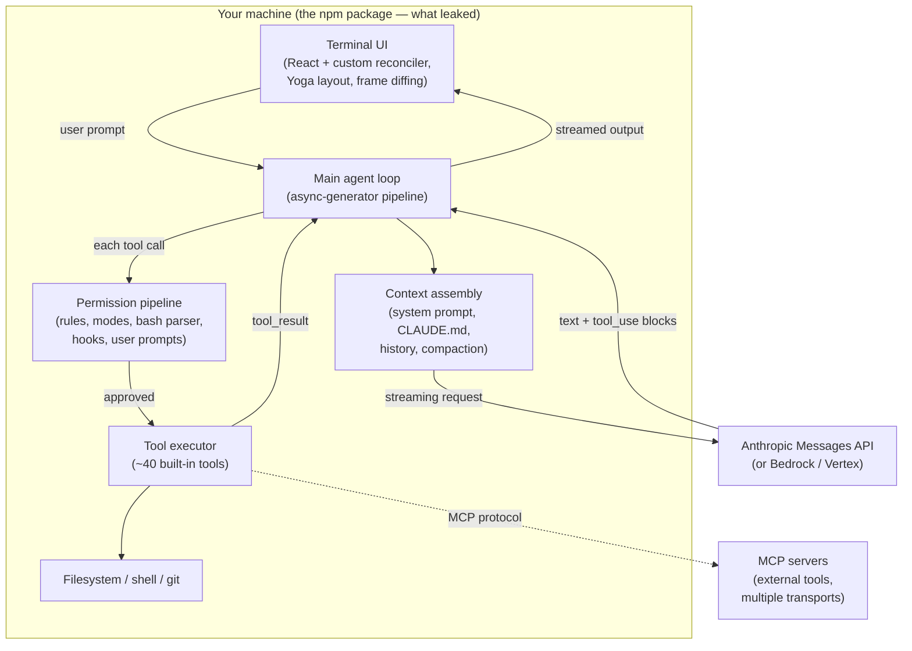
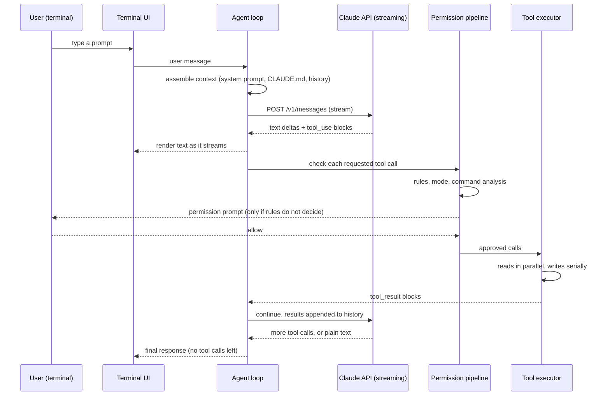
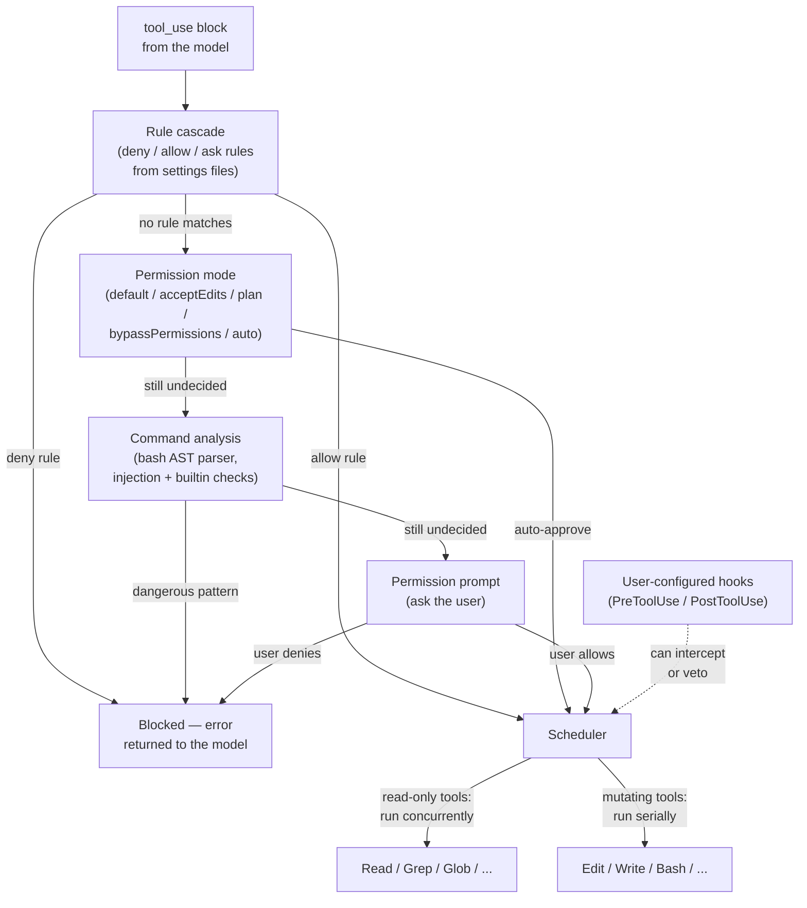
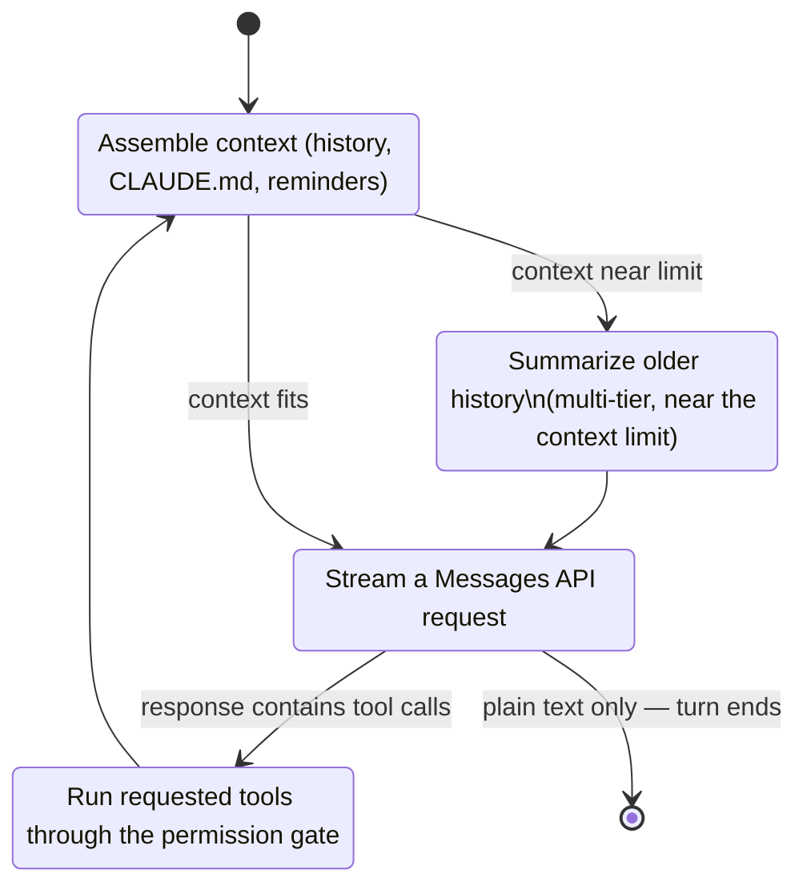

The fastest way to understand a system is to see it. A paragraph describing how requests move through four subsystems takes a minute to read and a while longer to hold in your head. The same thing as a diagram lands in a second.

Your coding agent can draw that diagram for you. Point it at a codebase, or ask it to research something it has never seen, and it renders the architecture as diagrams, live in the document, redrawing them as you talk. Here is what that looks like.

## Ask it to research a system and draw it

I picked a system this audience knows from the inside: Claude Code itself. Its client-side harness became public earlier in 2026: an npm release (version 2.1.88) shipped a source map with the whole thing, around 513,000 lines of TypeScript, and researchers wrote up how it works. I pointed an agent at those analyses and asked it to draw the architecture.

## A Claude Code architecture analysis

It came back with four views, each a diagram and a short explanation of what it shows.

### The harness and the model

The system splits into two halves. The model, running remotely behind the Messages API, makes the decisions: it reads the conversation and emits either text or `tool_use` blocks. The harness on your machine does everything else: it renders the terminal UI, assembles context, gates every tool call, and runs tools against your filesystem and shell. All model interaction goes through the API client; tools never talk to the model directly, and the model never touches your machine except by asking the harness to run a tool.

### What happens when you send a prompt

When you submit a prompt, the harness does not hand control to the model. It makes an API request and gets back a description of what the model wants to do. The model itself executes nothing. Each `tool_use` block passes through the permission pipeline, the approved ones run, and their results are appended to the message history for the next call. The loop repeats until a response arrives with no tool calls. Two touches from the source make it feel fast: the pipeline is built from async generators, so output streams end to end, and read-only tools can start while the response is still streaming in.

### The permission gate

Every tool call the model requests passes through this gate. There is no path from a `tool_use` block to your shell that skips it. Decisions are layered cheapest-first: explicit deny/allow rules from your settings resolve most calls instantly, the session permission mode handles the next tranche, and only the remainder reaches deeper analysis or an interactive prompt. That analysis stage is substantial in the leaked source: a recursive-descent bash parser of roughly 4,400 lines builds an AST of every shell command and rejects dozens of dangerous constructs before execution. Approved calls then partition by safety: read-only tools run concurrently, while anything that mutates state serializes.

### The loop that makes it feel autonomous

This loop is the single pattern behind everything Claude Code does: the leaked source confirmed there is no planner, no task graph, no hidden orchestrator, just a while-there-are-tool-calls loop over one flat message history. Autonomy is emergent: the model choosing tools well, not harness machinery. The same loop is also the unit of composition. A subagent is a fresh instance of this exact loop with its own isolated history, whose final answer returns to the parent as an ordinary `tool_result`. Long sessions stay inside the context window through tiered compaction.

## The part worth noticing

None of this came from inside Anthropic. The agent read the public write-ups of the source-map leak and reconstructed the architecture, and it got the shape right: every tool call gated, one flat loop instead of a hidden planner, the clean split between the local harness and the remote model. It also reached for the right kind of diagram for each idea: a flowchart for structure, a sequence diagram for the request path, a state diagram for the loop.

The diagrams are Mermaid: a few lines of code the agent writes, so they render live in the document as it works, sit next to the prose that explains them, and stay editable. The next time you open the document the agent can read the diagram it drew and change it, and the same fenced block renders on GitHub when the doc syncs to your repo. (For the times you need exact control over a drawing, an SVG block takes raw SVG, sanitized on render.)

Sources for the reconstruction: [InfoQ's report on the leak](https://www.infoq.com/news/2026/04/claude-code-source-leak/), [Karan Prasad's reverse-engineering write-up](https://karanprasad.com/blog/how-claude-code-actually-works-reverse-engineering-512k-lines), and the [claude-code-from-source](https://github.com/alejandrobalderas/claude-code-from-source) project.

## Try it on your own project

I do this all the time when I am exploring or building something: reading my way into an unfamiliar codebase, sketching a design before I write it, or explaining a subsystem to someone about to work in it. The picture is faster to produce than a paragraph and faster to understand.

The diagrams above began as a Squire document an agent wrote. Connect Claude Code to Squire Docs and you can do the same in your own repo: point it at the code and ask it to draw the architecture into a document. The Mermaid renders live as the agent writes it, sits right next to the explanation, and iterating is just a conversation: tell it what is off and watch it redraw. You will understand your own architecture faster, and so will everyone you share the document with.
