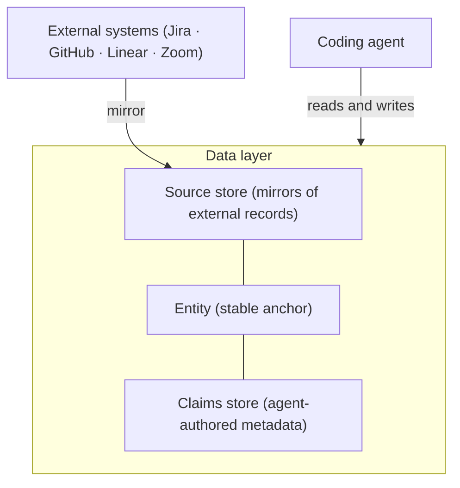
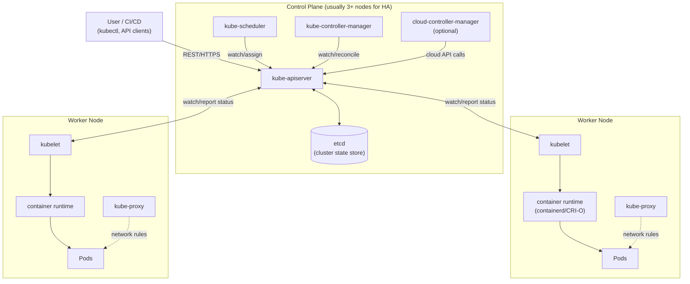

The fastest way to understand a system is to see it. A paragraph describing how data flows through four subsystems takes a minute to read and a while longer to hold in your head. The same thing as a diagram lands in a second. A picture says a thousand words, and now your coding agent can draw the picture for you and redraw it while you talk.

This is a story about doing exactly that: pointing an agent at a system I was designing, having it render an architecture diagram live in the document, and iterating on the picture until the design was right.

## The setup

I was designing a data layer. It had a lot of moving parts: several external systems mirrored into a local store, a separate store for metadata the agent produced, and a stable anchor tying the two together so everything could be queried as one thing. I had written it all down in prose. The prose was accurate and it was hard to follow. Nobody reviewing it could hold the whole shape in their head, and neither could I.

## Asking for the picture

The coding agent I was working with already had the context: it had read the codebase and the design notes. So I asked it to do one more thing. Read the current architecture and draw it as a Mermaid diagram in the document.

It wrote a diagram block. In Squire Docs a Mermaid block renders live as the code is written, so a few seconds later the picture was sitting in the document under the prose it described. Here is roughly what the agent produced:

Which renders as:

## The part where the design got sharp

Seeing the first draft is where it got useful. The picture showed things the prose had let me gloss over.

The two stores had been one blurry box in my head. On the diagram they were clearly separate, with different jobs and different write paths, and the moment I saw them apart I knew that was the real structure. So I told the agent: those are two stores, not one, and the anchor sits between them. It redrew. A few seconds later the corrected picture was there.

That became the loop. Look at the diagram, find the thing that was wrong or vague, say it in a sentence, watch the agent redraw. Move the anchor to the center. Show the mirror path as one direction, external systems in, never out. Split the metadata store into the two record types it actually held. Each turn was a sentence from me and a fresh picture from the agent, and each picture made the next problem obvious. The design got sharp because I could see it changing.

None of this was a special mode. The agent and I were editing the same document at the same time, the way two people would, except one of us could draw a clean diagram in seconds. The document's history shows both of us as authors on those edits.

## It works for a system you didn't build

That data layer was my own design, and the agent had read my code and my notes before it drew anything. But it does not need either. The same move works on a system the agent has never seen in your repository, because it can go research one first.

To see how far that goes, I gave an agent a prompt with nothing of mine in scope: "Can you research k8s and draw me a set of technical diagrams that illustrate how it works." It came back with a small reference — not one picture but four, each a different view of Kubernetes:

- a **cluster overview** that splits the control plane from the worker nodes and shows every path in and out of the API server;
- a **sequence diagram** tracing a `kubectl apply` as the API server persists it to etcd, the scheduler assigns a node, and the kubelet finally starts the containers;
- the **service traffic path**, from an external request through kube-proxy and a stable virtual IP to a healthy pod;
- and the **reconciliation loop** every controller runs — observe, compare desired state to actual, act, repeat — which is what makes the system self-healing.

Here is the cluster overview it wrote:

None of that is my system, and the agent got the details right: that only the API server talks to etcd, that the scheduler and kubelet are separate watchers rather than one pipeline, that the controllers reconcile in a loop. It researched Kubernetes and drew it, the same way it drew my data layer.

That is the general form of the idea. Point an agent at whatever you are working on — an unfamiliar codebase you are onboarding to, a dependency you are integrating, or a system like Kubernetes you just need to understand — and ask it to research the thing and draw it. You get a picture to think with, in the document, in seconds.

## Why live and in the document matters

The diagram was worth drawing because of where it lived and how it behaved.

**It rendered as I iterated.** There was no export step, no switching to a diagram tool and pasting a picture back. The change and the redraw happened in the same place, so iterating was cheap enough to do a dozen times.

**It sat next to the prose it explained.** The picture and the paragraph describing it were in one document, so they could not drift apart. When the design changed, both changed together.

**It stayed editable by the agent.** A Mermaid block exports to markdown as a fenced code block, so the next time I opened the document the agent could read the diagram it drew last week and change it, rather than starting over. The same fenced block renders as a diagram on GitHub, so the picture survives the trip into the repository.

## Mermaid and SVG

Squire Docs has two diagram blocks, and they cover two needs.

**Mermaid** is for structure: architecture, flows, sequences, state. You describe the shape in a few lines of code and the layout is handled for you, which is exactly what makes it cheap for an agent to write and rewrite. Most of the iterating above was Mermaid.

**SVG** is for when you need exact control over the drawing. An agent can write raw SVG into an SVG block, and Squire Docs sanitizes it on render, stripping scripts, event handlers, and references to outside resources, so a diagram written by an agent or a collaborator cannot do anything but draw.

## The payoff

Over a couple of weeks that data layer grew into a set of documents, and the diagrams did most of the work of keeping everyone aligned. The design went through many revisions, and most of the time the thing that moved a conversation forward was not a paragraph. It was a redrawn picture that made the new shape obvious at a glance.

Whether you are designing a system or trying to understand one, point your coding agent at it and ask for the picture. Then talk to the agent until the picture is right. You will understand the architecture faster, and so will everyone you show it to.
