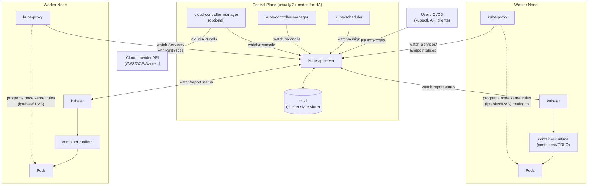
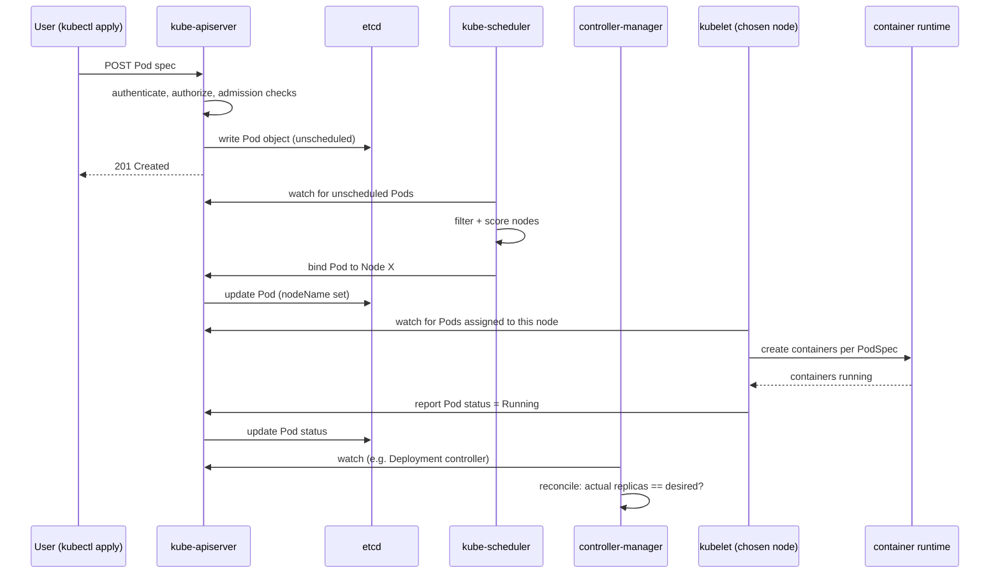
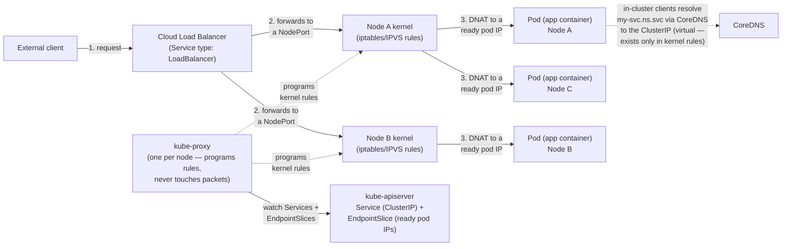
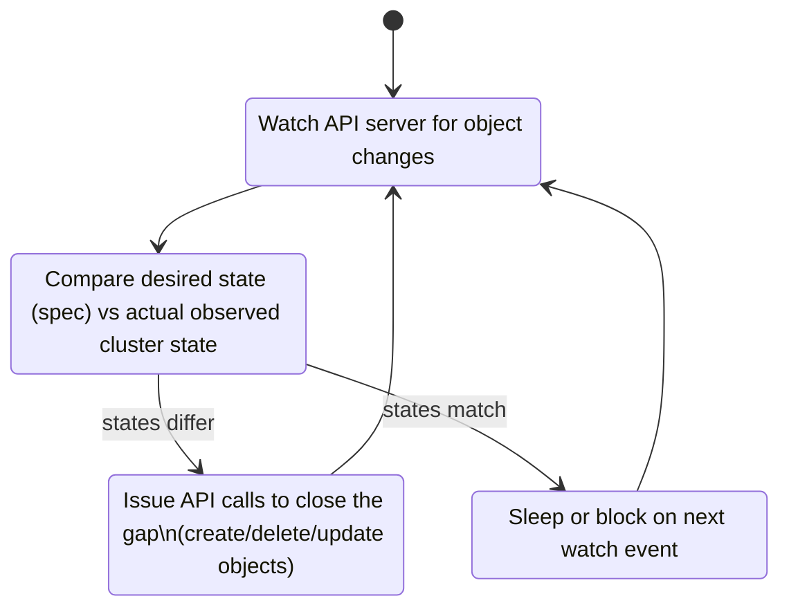

The fastest way to understand a system is to see it. A paragraph describing how requests move through four subsystems takes a minute to read and a while longer to hold in your head. The same thing as a diagram lands in a second.

Your coding agent can draw that diagram for you. Point it at a codebase, or ask it to research something it has never seen, and it renders the architecture as diagrams — live, in the document, redrawing them as you talk. Here is what that looks like.

## Ask it to research a system and draw it

I gave an agent a prompt with none of my own code in scope: "Can you research k8s and draw me a set of technical diagrams that illustrate how it works." It came back with a small reference — four views of Kubernetes, each a diagram and a short explanation.

### The cluster, end to end

A cluster splits into two halves. The control plane makes the decisions — it stores state, schedules pods, and runs the controllers that reconcile actual state toward what you asked for. The worker nodes run the workloads. Everything in and out of the control plane goes through the API server; nothing else, not even the scheduler or the controller manager, talks to etcd directly.

### What happens when you run `kubectl apply`

The API server validates the object and writes it to etcd immediately, before anything runs — it does not schedule the pod itself. The scheduler is a separate watcher that notices unscheduled pods, picks a node, and writes the assignment back. The kubelet on that node is what actually tells the container runtime to start containers, then reports status. Controllers run this same watch-and-correct loop continuously.

### How traffic reaches a pod

A Service is a stable virtual IP and DNS name for a set of pods that come and go as they scale or restart. kube-proxy on every node watches the live list of healthy pods and programs the node's iptables or IPVS rules — but it never touches packets itself; once the rules are in place, the kernel does the redirection. CoreDNS resolves the friendly Service name to that virtual IP.

### Why controllers all work the same way

This loop is the single pattern behind every controller in Kubernetes, from the built-in Deployment controller to custom operators: watch the objects you manage, compare desired state to what actually exists, issue API calls to close the gap, repeat forever. It is what makes the system self-healing — if a pod dies, the gap reappears on the next pass and the controller acts again, with no separate recovery code.

## The part worth noticing

None of that is my code. The agent researched Kubernetes and drew it, and it got the details right: only the API server talks to etcd, the scheduler and kubelet are separate watchers rather than one pipeline, kube-proxy programs rules instead of forwarding packets. It also reached for the right kind of diagram for each idea — a flowchart for structure, a sequence diagram for the scheduling flow, a state diagram for the loop.

The diagrams are Mermaid: a few lines of code the agent writes, so they render live in the document as it works, sit next to the prose that explains them, and stay editable. The next time you open the document the agent can read the diagram it drew and change it, and the same fenced block renders on GitHub when the doc syncs to your repo. (For the times you need exact control over a drawing, an SVG block takes raw SVG, sanitized on render.)

## Try it on your own project

I do this all the time when I am exploring or building something — reading my way into an unfamiliar codebase, sketching a design before I write it, or explaining a subsystem to someone about to work in it. The picture is faster to produce than a paragraph and faster to understand.

You can ask Claude Code to do the same thing in your repo: point it at the code and ask for the picture, then talk to it until the picture is right. You will understand your own architecture faster, and so will everyone you show it to.
