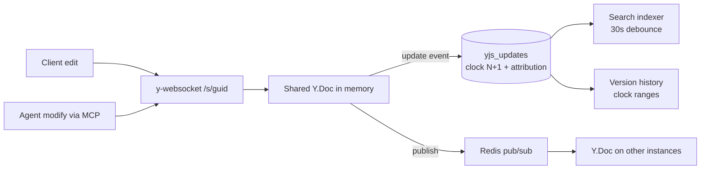

<!-- source: https://squiredocs.com/d/396c4ec7-9db5-4f91-b0c6-8c5faa9f0f65
     synced-by: design/sync.mjs — DO NOT HAND-EDIT; amend the Squire doc and re-sync -->

# Squire Collaboration Core

## What this is

The real-time editing substrate: how a document lives as a Yjs CRDT, syncs over WebSocket, persists to Postgres as an append-only update log, survives offline editing, and exposes version history. Everything else in Squire (agents, search, exports) sits on top of this.

## Real-time sync

- y-websocket in noServer mode; connections arrive on `/s/<docGuid>` and are auth-gated at upgrade time (cookie token first, `?token=` fallback for agents), then role-gated to view access (`server/index.js`).
- Edit enforcement is protocol-aware: `ws.emit` is intercepted, sync-update messages from viewers are dropped, and a 60-second DB role recheck disconnects revoked users (fail-closed).
- Presence is Yjs awareness: clients set a `user` field (id, name, color, picture, isAgent); the server evicts a client’s awareness state eagerly on disconnect and runs a 5-second ping/pong to catch dead sockets. Agents appear as live cursors through the same mechanism.
- **Amendment (2026-08-02, revised 2026-08-03 after adversarial review) — awareness identity is ownership-guarded (feature 044): **a connection may announce presence only for the Yjs clientIDs it owns. The server keeps its OWN ownership ledger per document, written as it allows frames — a connection's own announced ids, ids nobody holds and no record remembers, and ids last owned by the same authenticated user (reconnect, second tab). Records outlive the socket by a few minutes, so a participant who drops off keeps their identity until they return. A frame asserting anyone else's clientID is dropped whole before it is applied, broadcast or relayed, and the drop is counted with the asserting and holding principals so triage can tell squatter from victim. Participants on another instance are recorded as belonging to that instance and cannot be impersonated from this one: the guard runs on the socket a frame arrives on and relayed awareness is applied unguarded, so cross-instance protection is the SUM OF PER-INSTANCE ENFORCEMENT, not relay validation. Two limits are deliberate: a clientID nobody has ever announced belongs to whoever announces it first, and one user's own connections may assert each other's ids. _The first cut of this guard read ownership from y-websocket's per-connection controlled-id set; that was wrong twice over. _y-protocols never clears a client's awareness meta, so after any reconnect the id is re-announced as "updated" and never re-enters that set — ownership lapsed permanently and the guard failed open (silently) for every participant who blinked. The same blindness left every cross-instance participant unowned locally. And because the real y-websocket client re-broadcasts awareness it receives, honest participants routinely assert each other's ids: the guard must evaluate only the entries the applier's own precondition would act on, or a two-person session logs both users as spoofers. Cost is bounded deliberately: frames are capped at 64 asserted ids and a size limit, and the holder index is built once per frame — the guard must never do more work on a frame than the applier would.
- Multi-instance: Redis pub/sub fans out updates and awareness per doc (`server/redis-pubsub.js`), with origin sentinels preventing feedback loops and a per-instance ID filtering self-messages. Redis is optional; single-instance works without it.
- **Amendment (Sam, 2026-07-18) — agent presence is Redis-claim coordinated across instances: **Agent presence sessions (server/mcp/agent-presence.js) are instance-local: each pod holds its sessions in memory and opens its own y-websocket client, so the awareness identity is per-pod. Observed in prod 2026-07-18: with 2 replicas behind non-sticky Traefik routing (the 010/011 cutover dropped the old ingress’s CLIENT_IP affinity), two pods each created an agent session for the same user+doc, and Redis pub/sub faithfully merged both awareness clients — a duplicated “Squire Docs Assistant” avatar. The mechanism: a Redis presence claim keyed agent-presence:{userId}:{agentId}:{docGuid}, acquired with SET NX PX and heartbeat-refreshed; only the claim-holding pod announces the agent in awareness. The claim follows the work: a pod executing a tool call takes the claim over (Redis SET + pub/sub nudge), the previous holder silences its awareness immediately (setLocalState(null)), and the new holder announces and edits — highlights and cursor sweeps therefore always come from the pod doing the edits, at full fidelity. Non-holders still run working sessions (their edits merge fine — CRDT semantics); they are merely awareness-silent. Failover: claim TTL expiry lets a surviving session claim and re-announce (worst case the avatar blinks for one TTL window). Fail-open: without Redis the behavior is unchanged — single-instance deployments never duplicate. The handoff blink on a pod bounce is accepted; it replaces a duplicate avatar. Recorded with this amendment: the instance-local sessionsByKey cleanup must never delete a mapping now owned by a newer session (the cross-delete bug that let duplicates persist and snowball).
- **Amendment (Sam, 2026-07-18) — the editor binding must never destroy remote content (feature 021): **forensically confirmed incident: y-tiptap/y-prosemirror’s self-repair paths delete freshly-arrived REMOTE content and attribute the deletion to the WATCHING viewer — (a) the render catch in createNodeFromYElement/createTextNodesFromYText deletes the shared element when rendering throws, under a local origin, so it rides the viewer’s socket and identity; (b) an unguarded selection-restore throw aborts the render, leaving the view stale while Yjs advanced, and the next transaction of any kind (no docChanged check) runs the full editor→Yjs diff that "corrects" the shared doc back to the stale view. Fix contract: the binding (patched or forked) never deletes shared content on a render failure (log and skip rendering instead); selection restore is guarded with a safe near-fallback so it cannot abort a render; the editor→Yjs diff is gated on the transaction actually changing the doc; detected view/Yjs divergence resolves by re-rendering FROM Yjs, never by "correcting" Yjs from the view. Server guardrail: alert (exception-notifier) when a human-attributed update’s delete set covers content created by an agent within the last few seconds — this class of silent data loss becomes visible. Recovery note: log-derived undo (016) can invert viewer-attributed deletions once deployed.
- **Addition (Sam, 2026-07-18) — 021 refined by upstream research: **the 2026-07-18 web research confirmed no upgrade fix exists (y-prosemirror 1.3.7 and y-tiptap 3.0.7 both retain all three hazards verbatim; upstream closed the exact request as not-planned, issue #39; the selection-restore→stale-view→diff-deletion chain is unreported — Squire found it first; Gamma and Outline maintain private forks that still retain the catch-delete). Refinements to the fix contract: (1) SKIPPED-NODE PROTECTION — log-and-skip alone lets the next legitimate local edit’s editor→Yjs diff delete the skipped node through the front door; a skipped element must be protected (binding-generated placeholder preserving position/identity parity — upstream’s own CAVEATS.md suggestion — or tracked-skip exclusion in the diff). (2) Attempt createAndFill-style node filling before skipping (upstream v2’s approach). (3) Baseline bump first: vendored y-tiptap 3.0.1 → 3.0.7 (unrelated hardening reduces selection-restore throw causes), then the four patches via patch-package on that baseline — the patched functions are unchanged between versions. (4) Second defense layer, zero-fork: TipTap’s enableContentCheck/onContentError with the documented disable-collaboration quarantine for schema-outdated clients. (5) Follow-up owed: file the repro upstream (y-tiptap issue + y-prosemirror #39/#258 comment — the maintainer is active in exactly this area); track the v2 rewrite as the eventual exit ramp. Attribution finding confirmed: transaction origins do not cross the wire, so client-side "repairs" inherently masquerade as the viewer — never generate them client-side.
- **Amendment (Sam, 2026-08-01) — edit enforcement covers the WHOLE sync protocol, not just update messages (feature 038): **the ws.emit interceptor classified only [MESSAGE_SYNC, SYNC_UPDATE] as an edit, so SyncStep2 replies passed the viewer gate untouched — and y-protocols applies a step2 payload through the same Y.applyUpdate(doc, …, conn) path as an update. Consequences: (a) a viewer-role principal could write arbitrary content by framing it as a step2 reply, and the resulting yjs_updates row was stamped with their user_id — a write-permission bypass, not merely a mislabel; (b) because the server sends SyncStep1 to every connection on setup, every browser reconnect answers with a step2 containing whatever its IndexedDB cache holds that the server lacks — so after a gapped read or a fresh pod, one client re-supplies OTHER people's content and the log attributes all of it to whoever reconnected first. Fix contract: viewer connections have step2 frames dropped as well as update frames (protocol-safe — the server never awaits the reply, and the viewer still syncs downward); editor step2 stays allowed because it is the legitimate offline-edit path. The general rule this establishes: any protocol frame that can reach Y.applyUpdate is an edit for permission purposes, and new sync message types must be classified before they ship.

## Persistence: the update log and the clock

`server/postgres-persistence.js` stores every Yjs update as a row in `yjs_updates` keyed `(doc_guid, clock)` with user and agent attribution. The `clock` is a per-document monotonic integer assigned at write time (max+1 with ON CONFLICT retry, up to 5 attempts) — it is the version coordinate the whole system shares: version history ranges, the MCP conflict guard, diff endpoints, and the design-sync frontmatter all speak clocks. There is no compaction or squashing: `getYDoc` replays the full log on every load. There are no materialized document states: named versions are pure clock-range labels (snapshot_data dropped, feature 023), and the once-planned 24-hour Redis doc cache was never wired into any load path (dormant module removed, feature 042, amended 2026-08-02). Postgres is always the source of truth: bindState loads from it, never from any cache.

The write path (bindState’s update listener): skip if the origin is a db-load/redis sentinel → `storeUpdate` with retry/backoff → sync the denormalized title → mark the search index dirty. `writeState` is a deliberate no-op — persistence is per-update, not per-disconnect. Terminal persistence failure pages the exception notifier (data-loss risk).

**Amendment (2026-08-02, ratified-by-default under Sam's attribution-first ordering) — the publish-before-commit window is an attribution problem first (feature 045): **a pod dying between broadcast and durable commit leaves the lost edit alive in every connected client and their y-indexeddb caches; on reconnect the sync handshake's Step2 frame re-supplies it, and the row is stamped with the RELAYING user's identity plus via_sync=true. The version timeline is via_sync-blind today, so the relayer is displayed as the author of content they never wrote; with n clients the wrong stamp is the likely outcome. Ratified direction: (1) every author-displaying surface (timeline, drill-down, per-clock author, recent-authors) becomes via_sync-aware — a via_sync row's stamped identity is never displayed as authorship; true authorship is recovered where derivable by mapping the update's Yjs clientIDs to user_ids from prior attributed rows in the same document (preserving the 038 promise WHERE THE SESSION HAS PRIOR ATTRIBUTED ROWS in that document; a self-relay with no such evidence renders as synced content rather than a guess — RBD-045-10, flagged for ratification. Identities known to write through a shared server doc never bind at all, and the residual RBD-045-12 (flagged for ratification) is that a server write under a plain user identity is indistinguishable in the log from an offline edit — knowledge of which client ids belong to a shared server doc is INSTANCE-LOCAL, so this bites whenever the reader is not the writer's pod, not only when that pod has died. Its permanent fix is per-identity documents for server-side writes; cross-instance propagation of that knowledge was considered and rejected (it closes neither the dead-pod nor the not-yet-published case, and would make an outcome mutable after it had already been displayed). Treat single-replica operation as a precondition until that fix lands), and otherwise rendered as a synced/unknown contribution, never the relayer. (2) The collab-guardrail's agent-content selection must not go blind when agent content is re-supplied through a human connection. (3) The durability window itself keeps the FR-018 posture: SIGTERM drain covers deploys; SIGKILL-class loss (order of a few events per year) is a documented accepted residual under the pragmatic-B2B calibration, revisitable via durable-before-broadcast if hot-path latency ever becomes acceptable. via_sync governs DISPLAYED authorship only — never replay, undo derivation, or permissions.** Revised 2026-08-03: **Sam overturned RBD-045-12 and adopted constitution Principle VII (v1.2.0), so single-replica operation is no longer an acceptable standing posture and per-identity server docs is ratified design rather than a named future fix. See the Per-identity server docs section below. The one-replica deploy constraint stands only until that feature and the other scale-out gates land.

**Amendment (Sam, 2026-07-18) — reads tolerate clock gaps (feature 021): **getYDoc rebuilds from the update log in clock order with no gap tolerance, while clocks are acquired via MAX+1 retry races and persistence commits asynchronously — so a read racing a mid-commit row can see {…k, k+2…} and integrate nothing causally after the gap, returning a transient early-history skeleton (observed 2026-07-18: a headings-only read of a 6KB doc; self-healed on the next read). Fix contract: getYDoc detects a clock gap in the fetched rows and briefly retries the read before returning; a still-gapped result after the retry window is served as-is (the log is append-only — nothing is lost, the next read heals).

**Amendment (Sam, 2026-07-19) — clock order is causal order (feature 023): **the 2026-07-19 version-history deep dive found the write side gives no ordering guarantee: persistence is fire-and-forget per update and the MAX+1 clock race can commit a later update at an earlier clock — contiguous rows, undetectable by gap scans, permanently mislabeling that coordinate for every version, diff, restore, and conflict-guard read. The fix contract: **per-document write serialization** (a per-doc ordered queue or advisory lock in storeUpdate) so clocks are assigned in the order updates were produced, making clock order equal causal order by construction. Corollary hardening: the 021 gap-tolerance machinery must cover EVERY log-rebuild reader, not just getYDoc — either extend it to getYDocAtClock/getStateVectorsAtClocks/the diff service/the timeline replay, or genuinely funnel those readers through the one hardened choke point so the "single choke point" claim in the code becomes true. A diff or named-version snapshot must never be computed from a gapped or misordered row set and then cached/frozen as truth.

## Per-identity server docs

**Amendment (Sam, 2026-08-03), ratified design, not yet implemented: **the shared server doc stops authoring content operations. This section is the design contract for the feature "per-identity Y.Docs for server-side write paths", the follow-on required by constitution Principle VII (v1.2.0) and by the RBD-045-12 overturn recorded in specs/045-resupply-attribution/clarifications-needed.md. It refines the write path described above. Nothing in it changes what browsers or agent sessions do.

**The problem, restated: **several server-side write paths transact directly on the one live WSSharedDoc, so the content they create carries that doc's single Yjs clientID while each durable row is stamped with whichever identity acted. One clientID accumulates many identities' writes. The 045 resupply resolver copes by poisoning clientIDs it knows to belong to a shared doc, but that knowledge is process-local. Two residuals follow: a binding left behind by a pod that has since died, and two live pods giving different confident answers about the same row, one of them wrong. Sam overturned the accepted-residual status on 2026-08-03: correctness must not depend on replica count, so the fix must be structural. After this feature, every Yjs clientID in the durable log maps to exactly one (user, agent) identity by construction, and the resolver's answers are the same on every pod.

**What already conforms (a correction to the prior record): **research R12 and the resolver contract say every server-side write path transacts on the one live WSSharedDoc. That is overbroad, and per Principle VI the falsified claims are corrected here. Undo and redo inverses are computed in a fresh scratch doc (server/undo/inverse.js) and stored before they are applied, so they already carry a one-shot clientID bound to the undoing identity. Sync pushes build a fork doc with a pinned deterministic synthetic clientID (server/markdown-sync.js). The restore durable-log path computes on a temp doc. Only the paths marked "per-operation doc" in the table below still author on the shared doc today.

| Write path | Authors under (today) | Writes as | Change |
| --- | --- | --- | --- |
| Markdown import, the one-transaction write (REST PUT import, MCP create_document, chat import_markdown; server/markdown-import.js) | shared doc | importing principal (userId, token agent name) | per-operation doc |
| Document seed: meta title + seed nodes (createSeededDocument; MCP create, chat import, REST create, onboarding welcome doc) | shared doc | creating principal; the welcome doc stamps (user, "Squire Docs Assistant") | per-operation doc |
| Title set (MCP set_document_title) | shared doc | acting principal | per-operation doc; no meta-only cheap path in v1 |
| Empty-import anchor paragraph (chat-tools.js, api/docs-import.js, mcp/tools/create-document.js) | shared doc | importing principal | per-operation doc |
| Chat image insert (insert_image, chat-tools.js) | shared doc | (user, "Squire Docs Assistant") | per-operation doc |
| Restore, live path (version-history.js) | shared doc, transacting under ORIGIN_RESTORE | restoring user (agent name on MCP restores) | per-operation doc; the two restore paths unify |
| Restore, durable-log path | fresh temp doc | restoring user | none |
| Undo/redo inverse (undo/inverse.js) | fresh scratch doc, store-then-apply | undoing identity | none; add a pinning test |
| Two-way sync push (markdown-sync.js applySyncPush) | fork doc, pinned deterministic clientID | (user, "Repo Sync") | none; documented exception to the random-clientID rule |
| Browser edits; MCP and chat modify | own connection or agent-session doc | that identity | none |

The sync-push exception is safe: idempotent retries need byte-identical updates, which needs the pinned clientID. A collision requires two identities pushing identical content at the same baseline, and the resolver then sees two bindings and refuses as ambiguous. Never a wrong author.

**Mechanism, the ephemeral per-operation doc: **documentService.updateDocument keeps its signature and becomes the one implementation point. New shape: create a fresh Y.Doc (its clientID is random by construction; never pinned, never reused), seed it by applying the shared doc's current encoded state, run the caller's updateFn on the ephemeral doc inside one transaction, capture that transaction's update bytes, destroy the ephemeral doc, and merge the bytes into the shared doc with Y.applyUpdate(sharedDoc, bytes, origin), passing the same { userId, agentName } origin object as today. Struct clientIDs survive Y.applyUpdate, so the stored row's payload carries the ephemeral doc's clientID while its stamp carries the acting identity: a one-shot clientID bound to exactly one identity. Seed, transact, and merge run synchronously with no awaits between them, so no local edit can interleave. The concurrency surface is unchanged from the direct transact this replaces.

**A random clientID per operation is mandatory**, not an implementation detail. A stable per-identity clientID would mint duplicate (clientID, clock) pairs whenever the same identity runs two operations concurrently, or runs on two pods at once, and duplicate pairs corrupt the CRDT. Many clientIDs mapping to one identity is fine for resolution. One clientID mapping to many identities is the defect this feature ends.

**Restore becomes one path: **the live path stops transacting on the live doc. Compute the restore delta on an ephemeral doc seeded from the best trusted state (the trusted live doc when one is loaded here, per server/live-doc-trust.js; otherwise the persisted log), store the delta as the one attributed row, then broadcast it with applyLiveUpdate under ORIGIN_RESTORE. That is store-then-apply, matching undo and sync push, and it deletes the live-path capture machinery. Two consequences, both accepted: the restore crash window flips from broadcast-without-commit to commit-without-broadcast (the durable row replays on the next load, the safer half); and an edit landing during the store await merges with the restore instead of being replaced by it, which is the semantics the durable path and cross-pod restores (RBD-041-2) already have. The 041 invariant that the stored bytes are the applied bytes still holds: they are the same bytes.

**Attribution, persistence, and fan-out are unchanged: **the shared doc's update event fires with the merged bytes and the caller's origin object. The origin-scoped capture in updateDocument still captures exactly this call's bytes (origin object identity). The bindState persistence listener still parses the origin and stores one row stamped (userId, agentName). via_sync stays unset: only SyncStep2 frames set it, and these writes are not sync frames. y-websocket broadcasts to this pod's connections, and the attached Redis handler or the explicit publishIfUnhandled fan-out covers other pods. One behavior improves: a throwing updateFn now discards the ephemeral doc and leaves the shared doc untouched, where a direct transact could leave a partial mutation applied. The BindFailedError check after the merge is kept: a refused bind still fails the call instead of silently dropping the write.

**The invariant, and what pins it: **after this feature, the shared server doc's own clientID never authors a content operation. Everything that reaches the shared doc is pre-encoded bytes: browser frames, Redis relays, db loads, merge-backs, live applies. Pinned three ways. Jest guards assert that updateDocument and restoreVersion emit updates whose insert set (Y.parseUpdateMeta) never contains the shared doc's clientID, and that consecutive calls use distinct clientIDs. A unit test asserts updateFn receives a doc that is not the shared doc. And the resolver's live-peek poisoning stays wired as the production backstop: if a future path regresses, its resupplied rows render as the honest "Synced content" on the authoring pod, never as a wrong author.

**Undo and redo need no changes: **the identity predicates (isSameIdentity in server/agent-identity.js, used by undo/inverse.js and undo/legacy.js) match on row stamps plus the via_sync channel guard, never on clientIDs. Rows written through per-operation docs are therefore still the acting identity's own edits, recognized exactly as before. Regression coverage is owed: an import or a title set made through the new mechanism must remain undoable exactly as today.

**Presence is unchanged: **per-operation docs have no provider and no awareness, so they cannot announce. The announcing wrappers stay where they are: REST imports announce through import-presence, and MCP tools and chat modify announce through agent-presence sessions. Restore, undo, title sets, document seeds, and the chat image insert stay non-announcing, as today. Import-presence's origin-filtered observation keeps working because the merge-back carries the same origin object.

**Failure modes: **seeding reads the shared doc synchronously, so a half-loaded doc is exactly as visible to updateFn as it is today, and the existing guards keep their jobs (waitForDocLoaded on the REST import route, the agent-presence content wait, live-doc-trust for the read-to-store paths). A bind that fails between seed and merge is caught by the retained post-merge check. Merge-back cannot conflict: a fresh clientID cannot collide, and the CRDT merge is commutative. A crash between merge and persist keeps the RBD-045-5 posture, with one improvement: the lost operation's content, resupplied by a browser, now degrades to the honest "Synced content" entry (its only evidence row died with it, the same hedge as RBD-045-10) instead of feeding the shared-doc poisoning residuals.

**Costs, accepted: **

- Each server-side operation pays O(doc size) to seed the ephemeral doc. Title sets go from O(1) to O(doc size). A meta-only cheap path was considered and deferred; revisit only with profiling data.
- Each operation adds one clientID to the document state vector forever: a few bytes per operation in every future sync exchange, the same order as browser tab churn.
- No pooling in v1. If profiling shows a hot path (chat-assistant bursts), the recorded follow-on is a pooled per-identity, per-document doc with an idle TTL, generalizing the agent-presence session machinery rather than rewriting it.

**Resolver transition, what stays and what can go: **nothing is deleted at cutover. The durable CHAT_AGENT_NAME poisoning source stays: it covers every pre-cutover chat-surface row, including the onboarding welcome seed, which also stamps that identity and was missing from the 047 enumeration. Because no stamp-level discriminator exists, post-cutover assistant rows are also still refused on resupply: an accuracy cost, never a wrong person, unchanged from the 047 posture. The 2+ identity ambiguity source stays; it is general. The live-peek source becomes structurally unnecessary for new rows and is kept in v1 as the fail-honest tripwire above; deleting it and its init wiring is recorded cleanup once the invariant guards have soaked. Keeping that process-local knowledge is Principle VII compliant because it is now defense in depth, not correctness-bearing.

**What the resolver guarantees after cutover: **for rows written after this feature deploys, a confidently wrong author is impossible on any pod at any replica count, because every clientID in an insert set binds to exactly one identity by construction. Memoized outcomes become strictly immutable (nothing learns new shared-doc identities from new rows), and the resolver FIFO-eviction finding from the 2026-08-03 pre-deploy review is retired for new rows. Honest refusals remain where evidence genuinely died: a lost-then-resupplied server-side write renders as "Synced content". Pre-cutover rows keep the old residual shapes, bounded to a fixed and aging population.

**Scale-out boundary, stated so nobody over-reads this feature: **this is a precondition for running more than one app replica, not the green light. It closes the attribution gates: RBD-045-12 residuals 1 and 2 for new rows, and the resolver eviction finding. It does not touch the other multi-replica gates from the 2026-08-03 pre-deploy review: M3, where a refused bind plus a fast reconnect can leave the Redis subscription bound to the dead evicted doc so the rebuilt doc silently misses cross-pod edits; and M4, where a user reconnecting onto a pod that knows their clientID only as a remote principal is refused awareness for minutes. Both must be fixed before scale-out. Also unchanged: the RBD-045-5 durability window, cross-pod restore serialization (RBD-041-2), and undo supersession consulting only the local live doc. The one-replica deploy constraint stands until this feature and M3 and M4 all land.

**Alternatives considered and rejected: **

- A stable per-identity clientID: duplicate (clientID, clock) pairs under concurrency corrupt the CRDT. Rejected outright.
- A meta-only cheap path for title sets: a second write shape for a rare operation. Deferred, not designed; revisit with profiling data.
- Swapping the shared doc's clientID around a transact: mutates live shared state, is fragile under observer reentrancy, and leaves the invariant unpinned. Rejected.
- Cross-instance propagation of learned shared-doc identities: rejected in RBD-045-12, and again by Principle VII's cache-only rule for process-local knowledge.
- Pooled per-identity docs in v1: deferred follow-on, see costs above.

**Open for Sam: **

- Confirm the post-cutover assistant over-refusal: with no stamp discriminator, new assistant-authored rows still render as "Synced content" if resupplied. A discriminator needs a migration and buys accuracy on rare rows.
- Confirm restore's ordering change to store-then-apply: commit before broadcast, and a slightly wider window in which a concurrent edit merges with a restore instead of being replaced by it.
- Decide when the live-peek tripwire is deleted. v1 keeps it.

## Offline support

The client (`client/src/hooks/useYjs.js`) keeps one long-lived Y.Doc per document in a module cache, mirrored to IndexedDB via y-indexeddb (best-effort). Edits made offline accumulate locally and merge on reconnect — standard CRDT semantics, no special code path. The WebsocketProvider is stable across token refreshes; auth failures (close codes 4401/4403) stop the retry loop until a fresh token arrives, and awareness is rebroadcast on reconnect and tab-focus.

**Amendment (Sam, 2026-08-01) — reconnect re-supply is sync, not authorship (feature 038): **"no special code path" was true for merge semantics and wrong for attribution. A reconnecting client answers SyncStep1 with everything the server's state vector lacks, drawn from its IndexedDB mirror — which after a gapped read, a fresh pod, or a lost write includes content ORIGINALLY AUTHORED BY OTHER PEOPLE. That payload lands as a normal update stamped with the reconnecting user, so version history credits them with text they never typed. This is the same failure shape as the 021 binding incident (a client-side mechanism masquerading as the local user), reached by a different road. Mechanism: yjs_updates carries a nullable via_sync boolean, set when the row originated from a SyncStep2 frame rather than a live edit. Attribution is unchanged — a genuine offline edit is still that user's work and must stay attributed to them — but consumers that reason about authorship can now discount re-supplied rows: log-derived undo excludes them from identity runs, and the collab guardrail annotates pages whose trigger was sync-sourced. Rule of thumb for anything reading the log: a via_sync row proves the content reached the server through that client, never that the client wrote it.

## Version history

- **Auto versions: **updates are grouped into versions by a 5-minute inactivity gap (`server/version-history.js`), each with a clockStart/clockEnd range and its unique authors; pure CRDT-noise updates are filtered by replaying and comparing extracted XML.
- **Named versions: **`document_versions` rows cache a full-state snapshot at clockEnd; naming a mid-version clock splits the auto version at that boundary.
- **Restore is non-destructive: **the target content is deep-cloned over the current fragment inside a transaction and stored as a normal forward update — history is never rewritten, and the restore broadcasts live like any edit.** Amended 2026-08-03: **the restore transaction runs on a per-operation doc and the delta is stored before it is broadcast. Same visible semantics; see Per-identity server docs.
- **Diffs: **`server/diff-service.js` rebuilds both clock states (gc off), serializes to markdown, line-diffs, and re-parses with diffInsert/diffDelete marks; results are immutable and Redis-cached for an hour. See [Squire Document Model and Format Pipeline](https://squiredocs.com/d/6e425e03-1670-4773-987a-584d3d04dea3) for the serialization layer it rides on.
- **Amendment (Sam, 2026-07-18) — agent-edit undo is derived from the update log, not from a live session: **Undoing an agent edit is a log-derived surgical inverse, a sibling of restore. Given the edit’s clock range (persisted on the chat modify tool part and returned by every modify), the server reads those yjs_updates rows, extracts what the edit inserted (the structs in the updates) and what it deleted (their delete sets), and applies the exact inverse to the live doc as a NORMAL FORWARD UPDATE — history is never rewritten. Semantics match Y.UndoManager.popStackItem: edits made after the agent’s are preserved; content already deleted or superseded by later edits is skipped rather than resurrected; a fully-superseded edit yields an honest “nothing left to undo”. Redo derives the same way from the inverse’s own recorded clock range (invert the inverse), so the chain works indefinitely. Consequences: undo works from ANY instance and survives session expiry and restarts — the presence session’s in-memory Y.UndoManager is retired once this lands, and both undo surfaces (the chat Undo/Redo button and the MCP undo/redo tools, which share one handler) converge on the log-derived core; there is one undo mechanism, not two. The inverse update carries the standard origin attribution of the agent identity performing the undo. This replaces the session-lifetime undo stack that made undo silently fail when the serving instance did not hold the session (the pre-015 cross-pod orphan) and made the Undo button die with the session.

**Amendment (Sam, 2026-07-19) — replay is the sole source of truth; timeline scales O(rows); restore is undoable (feature 023): **three ratified changes from the deep dive. (1) **snapshot_data is dropped**: named versions become pure clock-range labels; content always comes from log replay (which self-heals under the gap machinery, unlike a frozen blob that can bake in a bad read forever). (2) The **"meaningful update" classification is persisted at write time** (the persistence path has the before/after context) instead of being recomputed by replaying the entire log with a full-doc serialization per update on every timeline request — history operations become O(rows) instead of O(log × doc size), which also erases the replay-cost argument for snapshots. (3) **Restore participates in log-derived undo**: restoreVersion records an agent_edits row (like modify does) so the chat Undo can invert a restore; today a restore is invisible to the undo system and un-undoable except by counter-restore. Restore also stops double-persisting (origin sentinel, hotfixed 2026-07-19) and its REST/MCP surfaces converge on identical attribution and broadcast behavior. Checkpoints/compaction remain deliberately deferred (Sam, Q5): replay-as-truth plus the import path’s canReconstruct forward-guard keeps that door open, and 023 must not foreclose it.

**Amendment (Sam D19, 2026-08-02) — web-UI restore is not an undo target (feature 040 post-merge cut): **This narrows point (3) of the 2026-07-19 amendment. Only agent/MCP restores record an agent_edits row (under the acting agent's own identity) and are undoable by that agent's undo tool; a human web-UI restore records NO edit record. It is attributed to the human in version history and is reverted by restoring again, not by undo. Rationale (040 D19): the chat Undo card contract depends on the LIFO target matching the card; routing human restores through the shared chat-assistant identity produced mislabeled attribution on human restores, and no shipped UI could reach the capability. Revival requires either a dedicated identity and queue for restores, or shipping the document-level undo-a-restore affordance first (040 OWED-1).

## Document lifecycle

Creation writes a `documents` row + owner share; server-seeded docs (MCP create_document, the onboarding welcome doc) go through one shared `document-service.createSeededDocument` path so birth flows don’t drift. Deletion is owner-only and removes the update log, S3 images (best-effort), shares, invites, and the record. Attribution flows through a single origin model (`server/origin.js`): every transaction carries `{userId, agentName}`, which is how presence, version authors, and per-update attribution stay consistent.