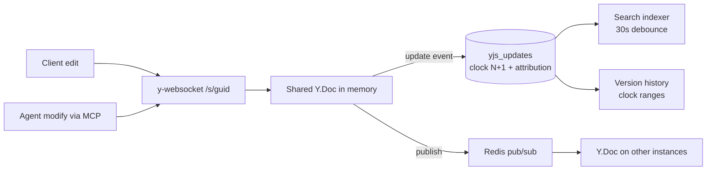

<!-- source: https://squiredocs.com/d/396c4ec7-9db5-4f91-b0c6-8c5faa9f0f65
     synced-by: design/sync.mjs — DO NOT HAND-EDIT; amend the Squire doc and re-sync -->

# Squire Collaboration Core

## What this is

The real-time editing substrate: how a document lives as a Yjs CRDT, syncs over WebSocket, persists to Postgres as an append-only update log, survives offline editing, and exposes version history. Everything else in Squire (agents, search, exports) sits on top of this.

## Real-time sync

- y-websocket in noServer mode; connections arrive on `/s/<docGuid>` and are auth-gated at upgrade time (cookie token first, `?token=` fallback for agents), then role-gated to view access (`server/index.js`).
- Edit enforcement is protocol-aware: `ws.emit` is intercepted, sync-update messages from viewers are dropped, and a 60-second DB role recheck disconnects revoked users (fail-closed).
- Presence is Yjs awareness: clients set a `user` field (id, name, color, picture, isAgent); the server evicts a client’s awareness state eagerly on disconnect and runs a 5-second ping/pong to catch dead sockets. Agents appear as live cursors through the same mechanism.
- Multi-instance: Redis pub/sub fans out updates and awareness per doc (`server/redis-pubsub.js`), with origin sentinels preventing feedback loops and a per-instance ID filtering self-messages. Redis is optional; single-instance works without it.
- **Amendment (Sam, 2026-07-18) — agent presence is Redis-claim coordinated across instances: **Agent presence sessions (server/mcp/agent-presence.js) are instance-local: each pod holds its sessions in memory and opens its own y-websocket client, so the awareness identity is per-pod. Observed in prod 2026-07-18: with 2 replicas behind non-sticky Traefik routing (the 010/011 cutover dropped the old ingress’s CLIENT_IP affinity), two pods each created an agent session for the same user+doc, and Redis pub/sub faithfully merged both awareness clients — a duplicated “Squire Docs Assistant” avatar. The mechanism: a Redis presence claim keyed agent-presence:{userId}:{agentId}:{docGuid}, acquired with SET NX PX and heartbeat-refreshed; only the claim-holding pod announces the agent in awareness. The claim follows the work: a pod executing a tool call takes the claim over (Redis SET + pub/sub nudge), the previous holder silences its awareness immediately (setLocalState(null)), and the new holder announces and edits — highlights and cursor sweeps therefore always come from the pod doing the edits, at full fidelity. Non-holders still run working sessions (their edits merge fine — CRDT semantics); they are merely awareness-silent. Failover: claim TTL expiry lets a surviving session claim and re-announce (worst case the avatar blinks for one TTL window). Fail-open: without Redis the behavior is unchanged — single-instance deployments never duplicate. The handoff blink on a pod bounce is accepted; it replaces a duplicate avatar. Recorded with this amendment: the instance-local sessionsByKey cleanup must never delete a mapping now owned by a newer session (the cross-delete bug that let duplicates persist and snowball).
- **Amendment (Sam, 2026-07-18) — the editor binding must never destroy remote content (feature 021): **forensically confirmed incident: y-tiptap/y-prosemirror’s self-repair paths delete freshly-arrived REMOTE content and attribute the deletion to the WATCHING viewer — (a) the render catch in createNodeFromYElement/createTextNodesFromYText deletes the shared element when rendering throws, under a local origin, so it rides the viewer’s socket and identity; (b) an unguarded selection-restore throw aborts the render, leaving the view stale while Yjs advanced, and the next transaction of any kind (no docChanged check) runs the full editor→Yjs diff that "corrects" the shared doc back to the stale view. Fix contract: the binding (patched or forked) never deletes shared content on a render failure (log and skip rendering instead); selection restore is guarded with a safe near-fallback so it cannot abort a render; the editor→Yjs diff is gated on the transaction actually changing the doc; detected view/Yjs divergence resolves by re-rendering FROM Yjs, never by "correcting" Yjs from the view. Server guardrail: alert (exception-notifier) when a human-attributed update’s delete set covers content created by an agent within the last few seconds — this class of silent data loss becomes visible. Recovery note: log-derived undo (016) can invert viewer-attributed deletions once deployed.
- **Addition (Sam, 2026-07-18) — 021 refined by upstream research: **the 2026-07-18 web research confirmed no upgrade fix exists (y-prosemirror 1.3.7 and y-tiptap 3.0.7 both retain all three hazards verbatim; upstream closed the exact request as not-planned, issue #39; the selection-restore→stale-view→diff-deletion chain is unreported — Squire found it first; Gamma and Outline maintain private forks that still retain the catch-delete). Refinements to the fix contract: (1) SKIPPED-NODE PROTECTION — log-and-skip alone lets the next legitimate local edit’s editor→Yjs diff delete the skipped node through the front door; a skipped element must be protected (binding-generated placeholder preserving position/identity parity — upstream’s own CAVEATS.md suggestion — or tracked-skip exclusion in the diff). (2) Attempt createAndFill-style node filling before skipping (upstream v2’s approach). (3) Baseline bump first: vendored y-tiptap 3.0.1 → 3.0.7 (unrelated hardening reduces selection-restore throw causes), then the four patches via patch-package on that baseline — the patched functions are unchanged between versions. (4) Second defense layer, zero-fork: TipTap’s enableContentCheck/onContentError with the documented disable-collaboration quarantine for schema-outdated clients. (5) Follow-up owed: file the repro upstream (y-tiptap issue + y-prosemirror #39/#258 comment — the maintainer is active in exactly this area); track the v2 rewrite as the eventual exit ramp. Attribution finding confirmed: transaction origins do not cross the wire, so client-side "repairs" inherently masquerade as the viewer — never generate them client-side.
- **Amendment (Sam, 2026-08-01) — edit enforcement covers the WHOLE sync protocol, not just update messages (feature 038): **the ws.emit interceptor classified only [MESSAGE_SYNC, SYNC_UPDATE] as an edit, so SyncStep2 replies passed the viewer gate untouched — and y-protocols applies a step2 payload through the same Y.applyUpdate(doc, …, conn) path as an update. Consequences: (a) a viewer-role principal could write arbitrary content by framing it as a step2 reply, and the resulting yjs_updates row was stamped with their user_id — a write-permission bypass, not merely a mislabel; (b) because the server sends SyncStep1 to every connection on setup, every browser reconnect answers with a step2 containing whatever its IndexedDB cache holds that the server lacks — so after a gapped read or a fresh pod, one client re-supplies OTHER people's content and the log attributes all of it to whoever reconnected first. Fix contract: viewer connections have step2 frames dropped as well as update frames (protocol-safe — the server never awaits the reply, and the viewer still syncs downward); editor step2 stays allowed because it is the legitimate offline-edit path. The general rule this establishes: any protocol frame that can reach Y.applyUpdate is an edit for permission purposes, and new sync message types must be classified before they ship.

## Persistence: the update log and the clock

`server/postgres-persistence.js` stores every Yjs update as a row in `yjs_updates` keyed `(doc_guid, clock)` with user and agent attribution. The `clock` is a per-document monotonic integer assigned at write time (max+1 with ON CONFLICT retry, up to 5 attempts) — it is the version coordinate the whole system shares: version history ranges, the MCP conflict guard, diff endpoints, and the design-sync frontmatter all speak clocks. There is no compaction or squashing: `getYDoc` replays the full log on every load. Named-version snapshots and a 24-hour Redis doc cache are the only materialized states; Postgres is always the source of truth (bindState loads from it, never the cache).

The write path (bindState’s update listener): skip if the origin is a db-load/redis sentinel → `storeUpdate` with retry/backoff → sync the denormalized title → mark the search index dirty. `writeState` is a deliberate no-op — persistence is per-update, not per-disconnect. Terminal persistence failure pages the exception notifier (data-loss risk).

**Amendment (Sam, 2026-07-18) — reads tolerate clock gaps (feature 021): **getYDoc rebuilds from the update log in clock order with no gap tolerance, while clocks are acquired via MAX+1 retry races and persistence commits asynchronously — so a read racing a mid-commit row can see {…k, k+2…} and integrate nothing causally after the gap, returning a transient early-history skeleton (observed 2026-07-18: a headings-only read of a 6KB doc; self-healed on the next read). Fix contract: getYDoc detects a clock gap in the fetched rows and briefly retries the read before returning; a still-gapped result after the retry window is served as-is (the log is append-only — nothing is lost, the next read heals).

**Amendment (Sam, 2026-07-19) — clock order is causal order (feature 023): **the 2026-07-19 version-history deep dive found the write side gives no ordering guarantee: persistence is fire-and-forget per update and the MAX+1 clock race can commit a later update at an earlier clock — contiguous rows, undetectable by gap scans, permanently mislabeling that coordinate for every version, diff, restore, and conflict-guard read. The fix contract: **per-document write serialization** (a per-doc ordered queue or advisory lock in storeUpdate) so clocks are assigned in the order updates were produced, making clock order equal causal order by construction. Corollary hardening: the 021 gap-tolerance machinery must cover EVERY log-rebuild reader, not just getYDoc — either extend it to getYDocAtClock/getStateVectorsAtClocks/the diff service/the timeline replay, or genuinely funnel those readers through the one hardened choke point so the "single choke point" claim in the code becomes true. A diff or named-version snapshot must never be computed from a gapped or misordered row set and then cached/frozen as truth.

## Offline support

The client (`client/src/hooks/useYjs.js`) keeps one long-lived Y.Doc per document in a module cache, mirrored to IndexedDB via y-indexeddb (best-effort). Edits made offline accumulate locally and merge on reconnect — standard CRDT semantics, no special code path. The WebsocketProvider is stable across token refreshes; auth failures (close codes 4401/4403) stop the retry loop until a fresh token arrives, and awareness is rebroadcast on reconnect and tab-focus.

**Amendment (Sam, 2026-08-01) — reconnect re-supply is sync, not authorship (feature 038): **"no special code path" was true for merge semantics and wrong for attribution. A reconnecting client answers SyncStep1 with everything the server's state vector lacks, drawn from its IndexedDB mirror — which after a gapped read, a fresh pod, or a lost write includes content ORIGINALLY AUTHORED BY OTHER PEOPLE. That payload lands as a normal update stamped with the reconnecting user, so version history credits them with text they never typed. This is the same failure shape as the 021 binding incident (a client-side mechanism masquerading as the local user), reached by a different road. Mechanism: yjs_updates carries a nullable via_sync boolean, set when the row originated from a SyncStep2 frame rather than a live edit. Attribution is unchanged — a genuine offline edit is still that user's work and must stay attributed to them — but consumers that reason about authorship can now discount re-supplied rows: log-derived undo excludes them from identity runs, and the collab guardrail annotates pages whose trigger was sync-sourced. Rule of thumb for anything reading the log: a via_sync row proves the content reached the server through that client, never that the client wrote it.

## Version history

- **Auto versions: **updates are grouped into versions by a 5-minute inactivity gap (`server/version-history.js`), each with a clockStart/clockEnd range and its unique authors; pure CRDT-noise updates are filtered by replaying and comparing extracted XML.
- **Named versions: **`document_versions` rows cache a full-state snapshot at clockEnd; naming a mid-version clock splits the auto version at that boundary.
- **Restore is non-destructive: **the target content is deep-cloned over the current fragment inside a transaction and stored as a normal forward update — history is never rewritten, and the restore broadcasts live like any edit.
- **Diffs: **`server/diff-service.js` rebuilds both clock states (gc off), serializes to markdown, line-diffs, and re-parses with diffInsert/diffDelete marks; results are immutable and Redis-cached for an hour. See [Squire Document Model and Format Pipeline](https://squiredocs.com/d/6e425e03-1670-4773-987a-584d3d04dea3) for the serialization layer it rides on.
- **Amendment (Sam, 2026-07-18) — agent-edit undo is derived from the update log, not from a live session: **Undoing an agent edit is a log-derived surgical inverse, a sibling of restore. Given the edit’s clock range (persisted on the chat modify tool part and returned by every modify), the server reads those yjs_updates rows, extracts what the edit inserted (the structs in the updates) and what it deleted (their delete sets), and applies the exact inverse to the live doc as a NORMAL FORWARD UPDATE — history is never rewritten. Semantics match Y.UndoManager.popStackItem: edits made after the agent’s are preserved; content already deleted or superseded by later edits is skipped rather than resurrected; a fully-superseded edit yields an honest “nothing left to undo”. Redo derives the same way from the inverse’s own recorded clock range (invert the inverse), so the chain works indefinitely. Consequences: undo works from ANY instance and survives session expiry and restarts — the presence session’s in-memory Y.UndoManager is retired once this lands, and both undo surfaces (the chat Undo/Redo button and the MCP undo/redo tools, which share one handler) converge on the log-derived core; there is one undo mechanism, not two. The inverse update carries the standard origin attribution of the agent identity performing the undo. This replaces the session-lifetime undo stack that made undo silently fail when the serving instance did not hold the session (the pre-015 cross-pod orphan) and made the Undo button die with the session.

**Amendment (Sam, 2026-07-19) — replay is the sole source of truth; timeline scales O(rows); restore is undoable (feature 023): **three ratified changes from the deep dive. (1) **snapshot_data is dropped**: named versions become pure clock-range labels; content always comes from log replay (which self-heals under the gap machinery, unlike a frozen blob that can bake in a bad read forever). (2) The **"meaningful update" classification is persisted at write time** (the persistence path has the before/after context) instead of being recomputed by replaying the entire log with a full-doc serialization per update on every timeline request — history operations become O(rows) instead of O(log × doc size), which also erases the replay-cost argument for snapshots. (3) **Restore participates in log-derived undo**: restoreVersion records an agent_edits row (like modify does) so the chat Undo can invert a restore; today a restore is invisible to the undo system and un-undoable except by counter-restore. Restore also stops double-persisting (origin sentinel, hotfixed 2026-07-19) and its REST/MCP surfaces converge on identical attribution and broadcast behavior. Checkpoints/compaction remain deliberately deferred (Sam, Q5): replay-as-truth plus the import path’s canReconstruct forward-guard keeps that door open, and 023 must not foreclose it.

**Amendment (Sam D19, 2026-08-02) — web-UI restore is not an undo target (feature 040 post-merge cut): **This narrows point (3) of the 2026-07-19 amendment. Only agent/MCP restores record an agent_edits row (under the acting agent's own identity) and are undoable by that agent's undo tool; a human web-UI restore records NO edit record. It is attributed to the human in version history and is reverted by restoring again, not by undo. Rationale (040 D19): the chat Undo card contract depends on the LIFO target matching the card; routing human restores through the shared chat-assistant identity produced mislabeled attribution on human restores, and no shipped UI could reach the capability. Revival requires either a dedicated identity and queue for restores, or shipping the document-level undo-a-restore affordance first (040 OWED-1).

## Document lifecycle

Creation writes a `documents` row + owner share; server-seeded docs (MCP create_document, the onboarding welcome doc) go through one shared `document-service.createSeededDocument` path so birth flows don’t drift. Deletion is owner-only and removes the update log, S3 images (best-effort), shares, invites, and the record. Attribution flows through a single origin model (`server/origin.js`): every transaction carries `{userId, agentName}`, which is how presence, version authors, and per-update attribution stay consistent.