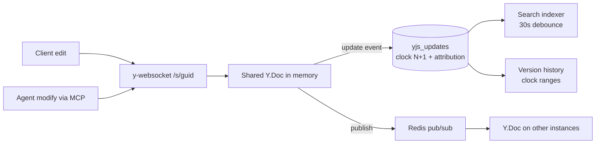

<!-- source: https://squiredocs.com/d/396c4ec7-9db5-4f91-b0c6-8c5faa9f0f65
     synced-by: design/sync.mjs — DO NOT HAND-EDIT; amend the Squire doc and re-sync -->

# Squire Collaboration Core

## What this is

The real-time editing substrate: how a document lives as a Yjs CRDT, syncs over WebSocket, persists to Postgres as an append-only update log, survives offline editing, and exposes version history. Everything else in Squire (agents, search, exports) sits on top of this.

## Real-time sync

- y-websocket in noServer mode; connections arrive on `/s/<docGuid>` and are auth-gated at upgrade time (cookie token first, `?token=` fallback for agents), then role-gated to view access (`server/index.js`).
- Edit enforcement is protocol-aware: `ws.emit` is intercepted, sync-update messages from viewers are dropped, and a 60-second DB role recheck disconnects revoked users (fail-closed).
- Presence is Yjs awareness: clients set a `user` field (id, name, color, picture, isAgent); the server evicts a client’s awareness state eagerly on disconnect and runs a 5-second ping/pong to catch dead sockets. Agents appear as live cursors through the same mechanism.
- Multi-instance: Redis pub/sub fans out updates and awareness per doc (`server/redis-pubsub.js`), with origin sentinels preventing feedback loops and a per-instance ID filtering self-messages. Redis is optional; single-instance works without it.
- **Amendment (Sam, 2026-07-18) — agent presence is Redis-claim coordinated across instances: **Agent presence sessions (server/mcp/agent-presence.js) are instance-local: each pod holds its sessions in memory and opens its own y-websocket client, so the awareness identity is per-pod. Observed in prod 2026-07-18: with 2 replicas behind non-sticky Traefik routing (the 010/011 cutover dropped the old ingress’s CLIENT_IP affinity), two pods each created an agent session for the same user+doc, and Redis pub/sub faithfully merged both awareness clients — a duplicated “Squire Docs Assistant” avatar. The mechanism: a Redis presence claim keyed agent-presence:{userId}:{agentId}:{docGuid}, acquired with SET NX PX and heartbeat-refreshed; only the claim-holding pod announces the agent in awareness. The claim follows the work: a pod executing a tool call takes the claim over (Redis SET + pub/sub nudge), the previous holder silences its awareness immediately (setLocalState(null)), and the new holder announces and edits — highlights and cursor sweeps therefore always come from the pod doing the edits, at full fidelity. Non-holders still run working sessions (their edits merge fine — CRDT semantics); they are merely awareness-silent. Failover: claim TTL expiry lets a surviving session claim and re-announce (worst case the avatar blinks for one TTL window). Fail-open: without Redis the behavior is unchanged — single-instance deployments never duplicate. The handoff blink on a pod bounce is accepted; it replaces a duplicate avatar. Recorded with this amendment: the instance-local sessionsByKey cleanup must never delete a mapping now owned by a newer session (the cross-delete bug that let duplicates persist and snowball).

## Persistence: the update log and the clock

`server/postgres-persistence.js` stores every Yjs update as a row in `yjs_updates` keyed `(doc_guid, clock)` with user and agent attribution. The `clock` is a per-document monotonic integer assigned at write time (max+1 with ON CONFLICT retry, up to 5 attempts) — it is the version coordinate the whole system shares: version history ranges, the MCP conflict guard, diff endpoints, and the design-sync frontmatter all speak clocks. There is no compaction or squashing: `getYDoc` replays the full log on every load. Named-version snapshots and a 24-hour Redis doc cache are the only materialized states; Postgres is always the source of truth (bindState loads from it, never the cache).

The write path (bindState’s update listener): skip if the origin is a db-load/redis sentinel → `storeUpdate` with retry/backoff → sync the denormalized title → mark the search index dirty. `writeState` is a deliberate no-op — persistence is per-update, not per-disconnect. Terminal persistence failure pages the exception notifier (data-loss risk).

## Offline support

The client (`client/src/hooks/useYjs.js`) keeps one long-lived Y.Doc per document in a module cache, mirrored to IndexedDB via y-indexeddb (best-effort). Edits made offline accumulate locally and merge on reconnect — standard CRDT semantics, no special code path. The WebsocketProvider is stable across token refreshes; auth failures (close codes 4401/4403) stop the retry loop until a fresh token arrives, and awareness is rebroadcast on reconnect and tab-focus.

## Version history

- **Auto versions: **updates are grouped into versions by a 5-minute inactivity gap (`server/version-history.js`), each with a clockStart/clockEnd range and its unique authors; pure CRDT-noise updates are filtered by replaying and comparing extracted XML.
- **Named versions: **`document_versions` rows cache a full-state snapshot at clockEnd; naming a mid-version clock splits the auto version at that boundary.
- **Restore is non-destructive: **the target content is deep-cloned over the current fragment inside a transaction and stored as a normal forward update — history is never rewritten, and the restore broadcasts live like any edit.
- **Diffs: **`server/diff-service.js` rebuilds both clock states (gc off), serializes to markdown, line-diffs, and re-parses with diffInsert/diffDelete marks; results are immutable and Redis-cached for an hour. See [Squire Document Model and Format Pipeline](https://squiredocs.com/d/6e425e03-1670-4773-987a-584d3d04dea3) for the serialization layer it rides on.
- **Amendment (Sam, 2026-07-18) — agent-edit undo is derived from the update log, not from a live session: **Undoing an agent edit is a log-derived surgical inverse, a sibling of restore. Given the edit’s clock range (persisted on the chat modify tool part and returned by every modify), the server reads those yjs_updates rows, extracts what the edit inserted (the structs in the updates) and what it deleted (their delete sets), and applies the exact inverse to the live doc as a NORMAL FORWARD UPDATE — history is never rewritten. Semantics match Y.UndoManager.popStackItem: edits made after the agent’s are preserved; content already deleted or superseded by later edits is skipped rather than resurrected; a fully-superseded edit yields an honest “nothing left to undo”. Redo derives the same way from the inverse’s own recorded clock range (invert the inverse), so the chain works indefinitely. Consequences: undo works from ANY instance and survives session expiry and restarts — the presence session’s in-memory Y.UndoManager is retired once this lands, and both undo surfaces (the chat Undo/Redo button and the MCP undo/redo tools, which share one handler) converge on the log-derived core; there is one undo mechanism, not two. The inverse update carries the standard origin attribution of the agent identity performing the undo. This replaces the session-lifetime undo stack that made undo silently fail when the serving instance did not hold the session (the pre-015 cross-pod orphan) and made the Undo button die with the session.

## Document lifecycle

Creation writes a `documents` row + owner share; server-seeded docs (MCP create_document, the onboarding welcome doc) go through one shared `document-service.createSeededDocument` path so birth flows don’t drift. Deletion is owner-only and removes the update log, S3 images (best-effort), shares, invites, and the record. Attribution flows through a single origin model (`server/origin.js`): every transaction carries `{userId, agentName}`, which is how presence, version authors, and per-update attribution stay consistent.