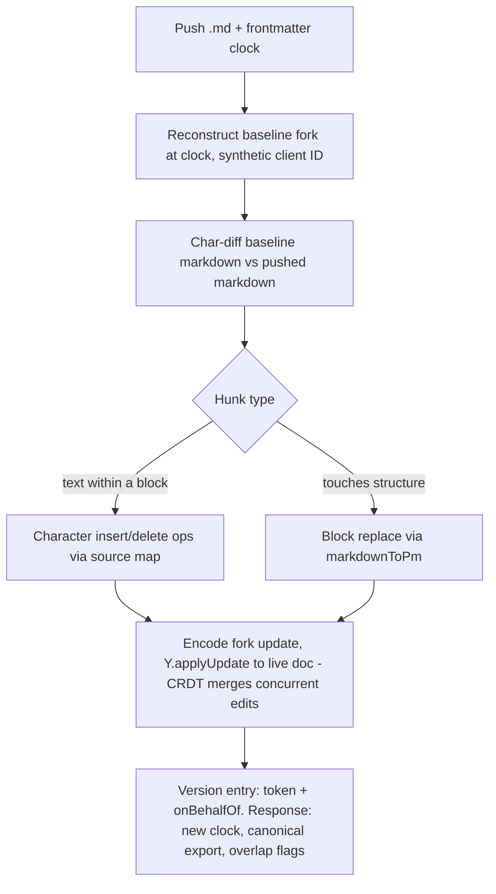

<!-- source: https://squiredocs.com/d/b6edb804-cf72-416d-9c97-063a23e669c0
     synced-by: design/sync.mjs — DO NOT HAND-EDIT; amend the Squire doc and re-sync -->

# Proposal: Markdown Import & Two-Way Repo Sync

_Status: Draft for review · Scope: generalize the markdown parser and expose import surfaces (Part 1), then make exports repo-portable and support round-trip sync with a Git repository (Part 2)._

## Summary

Squire today has a well-tested one-way markdown pipeline: rich-text documents export cleanly to markdown via the editor, the MCP `read_document` tool, and the REST export API. There is no import path in any direction — the only markdown parser in the codebase (`server/markdown-to-pm.js`) is deliberately restricted to re-parsing markdown that Squire itself produced, and is used only by the version-diff engine.

This proposal closes that gap in two parts. **Part 1** generalizes the parser to tolerant CommonMark + GFM and exposes it through four surfaces: an MCP helper, document creation, a REST import endpoint, and editor paste. **Part 2** makes exported markdown live well in a Git repo (task lists, frontmatter, portable formatting, working images) and defines a write-back protocol that treats the repo file as an offline collaborator: pushes replay as native CRDT operations anchored at the export clock, so round-tripping needs no conflict-resolution interface.

## Current State (grounded in the code)

- **Export: **`server/mcp/yjs/serialization.js` — a custom, hand-written serializer (`toMarkdown` / `toMarkdownNodes`). No third-party markdown library anywhere on the server.
- **Format registry: **`shared/format-registry.js` (M1 shipped 2026-07-13: relocated from server/) — single source of truth for inline marks and style props, shared by the serializer and both parser modes. This is the architectural asset the proposal builds on.
- **Parser: **`shared/markdown/` (M1 shipped 2026-07-13, feature 001 — supersedes the original description): `markdownToPm(markdown, diffMark, { strict })` — default tolerant CommonMark+GFM subset (emphasis variants, loose/lazy lists, setext, indented code, autolinks, escapes/entities, registry-derived HTML whitelist, never-lose-content guarantee); `strict: true` preserves the original exact dialect byte-identically (characterization-pinned) for the diff engine, which remains its caller.
- **REST API: **`GET /api/docs/:docId/export` (`server/api/docs-export.js`), markdown only, single-doc, authenticated by session or `sk_sqd_` tokens. No import counterpart.
- **MCP: **`read_document` emits markdown; `modify` accepts only structured blocks via `appendBlocks`. The modify tool documentation ships a manual regex example for converting markdown-ish text — evidence that agents need a real helper.
- **Editor: **markdown typing shortcuts come from TipTap StarterKit defaults only. No markdown paste handling (`client/src/extensions/ImageNode.js` handles image paste only), no source view, no copy-as-markdown.
- **Sync primitives: **`list_documents` already returns per-doc `clock` and `lastModifiedAt` and accepts `updatedSince` — the building blocks for incremental pull sync exist; push does not.

## Design Decision: Extend the In-House Parser (not a library)

Two options were considered for getting a general-purpose parser: adopt a library (remark/micromark or prosemirror-markdown) or generalize `markdown-to-pm.js`. **Recommendation: generalize the in-house parser.**

| Consideration | Extend in-house parser | Adopt remark/micromark |
| --- | --- | --- |
| Format knowledge | Stays centralized in format-registry.js — one place to add a mark for schema, export, and import | Bifurcates: registry drives export, library AST drives import; every new mark touched in two dialects |
| CommonMark edge cases | Must be hand-built (emphasis nesting, loose lists, HTML passthrough) — the real cost of this option | Free and battle-tested |
| Squire-specific dialect | Native: mermaid/svg fences, <u>/<mark>/<span style> HTML marks, app image URLs already handled | Requires custom plugins/handlers for every Squire extension |
| Round-trip guarantees | Existing registry-driven round-trip test suite (format-roundtrip.test.js) extends naturally | Two grammars to keep in agreement; fidelity bugs live in the seams |
| Dependency surface | Zero new deps (matches current posture: no markdown lib on the server) | New dependency tree in the export/import path |

The deciding factor: Squire’s dialect is not plain CommonMark (diagram fences, HTML-tag marks, style spans, app-relative image URLs), so a library would need substantial custom plugins anyway — at which point we are maintaining bespoke code either way, but with the format knowledge split across two systems. The mitigation for the edge-case cost is to define an explicit supported grammar (below) rather than chasing full CommonMark conformance, and to import the official CommonMark + GFM spec test fixtures for the constructs we do support.

## Part 1 — Generalize the Parser and Expose Import

### 1.1 Parser generalization (server/markdown-to-pm.js)

Evolve `markdownToPm` from “the subset `toMarkdown()` emits” to a tolerant CommonMark + GFM subset. Target grammar, in priority order:

1. **Emphasis variants: **accept `*bold*` / `**bold**` / `_italic_` / `*italic*` interchangeably (today only the exact forms the serializer emits parse), including nesting and intraword rules.
2. **GFM task lists: **`- [ ]` / `- [x]` → new taskList/taskItem nodes (schema work in Part 2.1; until then, degrade to bulletList).
3. **Loose vs tight lists, lazy continuation, and multi-paragraph list items** — agent- and human-authored markdown uses these constantly.
4. **Setext headings, indented code blocks, autolinks** (`<https://…>` and bare URLs).
5. **Escaped characters and HTML entities** per CommonMark (`\*`, `&amp;`).
6. **HTML passthrough policy: **whitelist the tags the registry already understands (`<u>`, `<mark>`, `<sub>`, `<sup>`, `<span style>` with the registry’s style props, `<br>` → hardBreak). All other HTML is preserved as literal text — never executed, never dropped silently.

Structure: split the file into a small line-classifier (block starts) plus an inline tokenizer that continues to be driven by `buildInlineRegex()` in the registry, extended with alternate-delimiter entries. Keep the function signature (`markdownToPm(markdown, diffMark)`) so `diff-service.js` is untouched. Add a `strict` option: the diff engine can opt into today’s exact-dialect behavior if we want to be conservative there.

**Unknown-construct rule: **anything unparseable degrades to a plain paragraph preserving the literal text. Import must never lose content — worst case it loses structure.

### 1.2 Import surfaces

Four surfaces, all thin wrappers over one new server module `server/markdown-import.js`: `importMarkdown(ydoc, markdown, { mode })` where mode is `append`, `replace`, or `insertAfterXPath`. It calls `markdownToPm` and materializes the result into the Yjs fragment (the inverse of `toMarkdownNodes`).

1. **MCP sandbox helper — fromMarkdown(md). **Add to `server/mcp/sandbox/helpers.js`: returns detached Yjs nodes (same contract as `cloneBlocks`), so scripts compose it with existing positioning: `doc.insert(doc.length, fromMarkdown(md))` or `appendBlocks`-style placement. Replaces the regex example in the modify tool docs.
2. **create_document — optional markdown parameter. **One call creates a populated doc. This is the on-ramp for “agent produced a markdown spec, get it into Squire” and for migrating existing ADRs/PRDs.
3. **REST — PUT /api/docs/:docId/import and POST /api/docs/import. **Body: `text/markdown`. PUT targets an existing doc with `mode=append|replace` and requires the `documents:write` scope — the scope already exists on MCP tokens (spec-phase correction, 2026-07-13: an earlier draft called it new; what is new is REST-route enforcement, since the export route checks only `documents:read`). POST creates a new doc from markdown (title from frontmatter or first heading). Mounted next to the export router in `server/index.js`; this is the write half of the sync protocol in Part 2.4.
4. **Editor paste. **A TipTap `transformPasted`/`clipboardTextParser` extension in `client/src/extensions/`: when pasted plain text scores as markdown (cheap heuristic: line-start tokens like `#`, `- `, `````, pipes), convert to rich blocks. Undo restores the plain-text paste, mirroring the Slack lesson from the market analysis: never trap the user in the conversion.

**Shared code note: **the parser must run server-side (REST, MCP) and client-side (paste). `markdown-to-pm.js` and `format-registry.js` have no Node-only dependencies today; move them under `shared/` alongside `prosemirror-schema.js` so one grammar serves both. Client materialization goes through ProseMirror slices rather than Yjs nodes, but from the same ProseMirror-JSON output.

**Image policy on import: **external image URLs in imported markdown are currently stripped by the `isAllowedImageSrc` guardrail. Import should instead fetch-and-rehost into S3 (size-capped, content-type-checked), falling back to a link when rehosting fails — matching how the imagesCopied pipeline already rewrites cross-document srcs after modify scripts run.

### 1.2.1 Import receipts and born-syncable creation (amendment 2026-07-14, agent feedback)

Source: [Agent feedback: file sync vs live editing](https://squiredocs.com/d/2eb514cd-547c-42be-b38e-a4298e0be555) — a Claude Code session retyped an on-disk markdown file through model context via `create_document({ markdown })` because the REST byte channel was not discoverable at the decision moment, and could not verify fidelity because import responses carried no content receipt. All six items accepted; two change this contract:

- **Verification receipt on every import. **POST /api/docs/import and PUT ?mode=append|replace responses gain `markdown` — the canonical re-export of the post-import document state, read atomically at the receipt clock (the same reExport used by mode=sync receipts). Fidelity checking becomes an exact string comparison instead of a hand-normalized diff. Receipt flavor: `flavor=portable|squire` query param, default portable (matching the export route default). RATIFIED-BY-DEFAULT (Sam pre-authorized, 2026-07-14): full canonical markdown, not a content hash — a hash is not client-recomputable without replicating canonicalization, and bodies are already capped at 5 MB.
- **Born-syncable creation. **Both import routes accept `frontmatter=true` (default false), stamping the receipt markdown with the squire frontmatter block (docGuid, title, clock, flavor — §2.3). Written back over the source file, it makes a file-created document a valid mode=sync baseline from birth: the repo-to-Squire lifecycle becomes edit file → push → rewrite file from receipt. RATIFIED-BY-DEFAULT (Sam pre-authorized, 2026-07-14): supported on PUT as well as POST — a replace push wants a fresh baseline for the same reason a create does.

The remaining items are discoverability, not contract: the REST reference in `get_tool_documentation` is exposed as `rest_api` (with `export_api` kept as an accepted alias — the doc has covered import since M2 but was findable only under the export name); the `create_document` and `modify` tool descriptions redirect agents holding an existing file to the import routes; the MCP server instructions state the channel rule — content that already exists as bytes outside the model travels the byte channel (REST); model context only carries content the model itself creates or transforms; `create_access_token` returns an import curl example beside the export one and its description notes that pushing needs `scopes: ['documents:read','documents:write']` (the default mint is read-only); and the REST 403 INSUFFICIENT_SCOPE payload gains a hint naming the missing scope and the re-mint remedy.

## Part 2 — Repo-Portable Export and Two-Way Sync

### 2.1 Schema: task lists

Add `taskList` / `taskItem` (with `checked` attr) to `shared/prosemirror-schema.js`. Spec-driven workflows are checklist-heavy — acceptance criteria and task breakdowns round-tripping as `- [ ]` is table stakes for the target market. Touch points, each small because of the registry pattern: schema node, TipTap TaskList/TaskItem extensions in `client/src/extensions/editorExtensions.js`, a case in `toMarkdownNodes`, a branch in the parser’s list handling, and an `appendBlocks` block type so agents can write checklists.

### 2.2 Export fidelity fixes

- **hardBreak: **add an explicit case in `toMarkdownNodes` emitting a trailing-backslash break; today it falls through the recurse fallback and is silently dropped. Parser accepts backslash and `<br>` forms.
- **Portable mode: **a `flavor=portable` serializer option (default for repo sync; current output remains `flavor=squire`). Portable degrades HTML-only marks for GitHub rendering: underline → emphasis, highlight → `==text==` or bold, color/font spans → dropped styling with text preserved. Degradations are annotated in the frontmatter (`lossy: [underline, textStyle]`) so a sync tool knows the file is not a faithful source for replace-mode write-back of those marks.
- **Images: **exported `` links are broken outside the app. Portable mode bundles image binaries alongside the markdown and rewrites references to relative `./assets/<docSlug>/…` paths, delivered via a new `GET /api/docs/:docId/export?format=bundle` returning a zip of the .md plus assets. On import, `./assets/` references resolve back to the original image ids via the frontmatter mapping — diagrams round-trip. (Rejected alternative: absolute URLs into the app — auth-gated image links in an otherwise-portable file are confusing outside Squire, so assets are the only portable-mode option.)
- **Mermaid/SVG fences** already export as ````mermaid` — GitHub renders these natively. No change; preserve in both flavors.

### 2.3 Frontmatter: the sync contract

Export gains `frontmatter=true` (default for the sync use case) emitting YAML that makes a repo file self-describing — no side-channel mapping file:

```
---
squire:
  docGuid: b6edb804-cf72-416d-9c97-063a23e669c0
  title: Payments Service Redesign
  clock: 1482            # doc version this file was exported at
  exportedAt: 2026-07-12T18:04:11Z
  lastModifiedBy: liz@example.com
  flavor: portable
  lossy: [textStyle]
  images:
    ./assets/payments/arch-1.png: img_9f2c
---
```

The parser strips the `squire:` block on import and uses it for targeting (docGuid) and baseline reconstruction (clock). Non-Squire frontmatter is preserved as-is at the top of the doc body, since spec-kit and static-site tooling may own their own keys.

### 2.4 Two-way sync protocol

The core problem: the live document is a CRDT edited in real time, while the repo copy is a text snapshot edited between exports. The file itself carries no CRDT state — but the server does: version history can reconstruct the document’s full Yjs state at the frontmatter clock. That enables a stronger model than text-level merging: **treat the repo editor as an offline collaborator**. Pushed edits are converted into native Yjs operations anchored at the baseline state and applied to the live doc, so CRDT convergence does the merging — deterministically, with no conflict states and no resolution interface.

1. **Pull (repo ← Squire): **unchanged — `list_documents` with `updatedSince`, compare each doc’s `clock` to the file’s frontmatter clock, re-export changed docs.
2. **Push — fork the baseline: **the server reconstructs the Y.Doc at the frontmatter clock from version history and forks it under a synthetic client ID representing this push.
3. **Push — two-way diff: **character-diff the baseline’s canonical markdown against the pushed markdown (parsed and re-serialized first). Only the file and its own ancestor are compared — the live doc is not involved, so there are no merge decisions. Formatting-only edits (reflowed lines, `*` vs `**`) canonicalize to an empty diff and a no-op push.
4. **Push — replay as ops: **map each hunk onto the forked doc through a serializer source map (markdown offset → Yjs node + offset). Text edits inside a block become character-level insert/delete ops; hunks touching markdown structure become block replacements (mechanics in 2.4.1).
5. **Push — CRDT merge: **encode the fork’s update-since-baseline and `Y.applyUpdate` it onto the live doc. To Yjs this is indistinguishable from a collaborator who went offline at the baseline clock, edited, and reconnected: concurrent edits interleave exactly as they do between live editors. A clock-equal push (nobody edited meanwhile) is just the degenerate case, not a separate fast path — and because CRDT application is order-independent, someone typing mid-push is harmless: no compare-and-set, no retry loop.
6. **Close the loop: **the response returns the new clock, the canonical re-export (the sync tool rewrites the local file so it is immediately a valid next baseline), and advisory overlap flags for blocks both sides changed.
7. **Attribution: **the synthetic client’s ops land as a normal version entry under the `sk_sqd_` token’s identity plus optional `onBehalfOf` metadata (git commit author/sha) — agent output entering the doc stays provenance-tracked, per the governance positioning.

**Why no conflict interface is needed: **conflicts are a text-merge concept — they exist when a merge algorithm must choose between two versions. Here nothing chooses: both edit streams are operation sets over a shared baseline state, and Yjs convergence applies both, the same way it does for two live editors. An earlier draft of this proposal argued Yjs-native merging was “impossible by construction” because the file has no CRDT state; the correction is that the _server_ supplies the CRDT state — the frontmatter clock is a pointer into version history, not just a conflict-detection token. The cost of this model is silent convergence (analyzed in 2.4.1), reviewed after the fact via version history rather than gated up front.

**Round-trip invariant: **for any doc, `import(export(doc))` must be a no-op (empty character diff against the canonical serialization, squire flavor). This is what keeps a pull/push cycle from generating phantom edits, and becomes a standing property test in CI. It also implies canonicalization on push: a repo edit that only reformats markdown (e.g. `*` → `**` bold) produces an empty diff, zero ops, and no version entry.

Push decision flow:



### 2.4.1 Replay mechanics (offline-collaborator model)

**Serializer source map: **as `toMarkdownNodes` walks the tree it additionally records, for every emitted text run, the markdown character range and its (Yjs text node, offset). Syntax characters — `#`, `**`, list markers, fences, table pipes — map to no text node; they belong to structure. This is cheap to add precisely because the serializer is in-house, and it is the piece an off-the-shelf markdown library could not provide.

**Hunk classification: **each diff hunk is classified by what its range covers. **Text hunks** fall entirely within one block’s mapped text and replay as character-level insert/delete (and format) ops on the forked doc — all untouched marks and text in the block survive. **Structural hunks** touch syntax characters or cross block boundaries; the affected block range on the fork is replaced with nodes parsed by `markdownToPm`. Whole-block insertions and deletions are structural by definition. The classifier prefers the text interpretation whenever the hunk can be expressed as one — structural replacement is the coarser, more destructive op (see the outcome table).

Concurrent-edit outcomes under CRDT merge:

| Repo-side change | Concurrent doc-side change | Outcome |
| --- | --- | --- |
| text edit in block A | edits anywhere else | both apply cleanly |
| text edit in block A | text edit, different span, same block | both apply — finer-grained than any block merge; no whole-block clobber |
| text edit | rewrite of the same span | characters interleave; may read oddly — flagged as overlap |
| block replace (structural) | text edit inside that block | replacement wins; the doc-side edit is dropped with the old node — flagged as overlap |
| block delete | edit inside that block | deletion wins — flagged as overlap |
| block insert at an anchor | insert at the same anchor | both survive; deterministic CRDT ordering |

**Advisory review instead of blocking conflicts: **the server detects doc-side change since the baseline via state vectors (the fast-path gate), and identifies _which_ blocks changed with a block-level LCS of the baseline-vs-live canonical markdown (as-built amendment, 2026-07-13, feature 004: an earlier draft said state vectors also did the identification; the shipped equivalent uses SV-gate + block LCS — identical at block granularity, without walking Yjs item clocks). Any block where repo-side ops also landed is listed in the push response as an overlap. The sync tool can surface these (CI annotation, commit message), and the existing version-diff view is the review surface inside Squire. Nothing blocks: no pending-conflict state, no 409-on-conflict, no stacking problem, and no new editor UI.

**Worked example: **baseline paragraph “Retries use exponential backoff.” Liz appends “with jitter” in Squire while a spec-kit run edits the repo file, replacing “exponential backoff” with “fixed 5s intervals”. The push replays a character-level replacement of exactly that span; Yjs merges both edits: _Retries use fixed 5s intervals with jitter._ — a coherent result produced with no interface at all. When both sides rewrite the _same_ span, the interleave can read oddly; that block arrives flagged as an overlap and gets a human pass in version history — the same recovery as an odd live-editing collision.

**Properties and v1 limits: **(a) same-span rewrites can interleave awkwardly — identical semantics to live concurrent editing, surfaced by overlap flags rather than prevented. (b) structural replacement drops concurrent intra-block edits (flagged); mitigated by the classifier preferring character ops wherever possible. (c) lossy portable flavor actually improves under this model: character ops leave doc-side underline/color marks intact except inside structurally replaced blocks — `lossy:`-listed marks are still excluded from the diff so degradation never masquerades as an edit. (d) **hard prerequisite:** version history must reconstruct doc state at any clock within the sync retention window — promoted from open question to requirement; the retention policy itself remains open.

### 2.5 Reference sync tooling

The protocol is API-first so any client can implement it, but ship a reference implementation to productize the workflow this proposal came from: a small `squire-sync` CLI (`pull` / `push` / `status` against a directory of frontmattered .md files) plus a GitHub Action wrapping it. Design docs authored collaboratively in Squire land in the repo for spec-kit; spec-kit’s edits flow back for review in Squire. This is deferred until the API halves are proven — it is packaging, not architecture.

## Milestones

| Milestone | Deliverables | Depends on |
| --- | --- | --- |
| M1 — General parser | markdown-to-pm.js generalized (emphasis variants, loose lists, setext, escapes, HTML whitelist); moved to shared/; strict mode for diff-service; CommonMark/GFM fixture tests | — |
| M2 — Import surfaces | fromMarkdown() sandbox helper; markdown param on create_document; PUT/POST import routes + documents:write scope; image fetch-and-rehost | M1 |
| M3 — Portable export | taskList/taskItem schema + editor + serializer + parser; hardBreak fix; flavor=portable; frontmatter; asset bundle export | M1 (parser must read what M3 writes) |
| M4 — Two-way sync | Baseline reconstruction (fork at clock); serializer source map; char-diff → op replay with structural fallback; overlap flags; onBehalfOf attribution; round-trip invariant test in CI | M2, M3 |
| M5 — Packaging | squire-sync CLI + GitHub Action; editor paste conversion; docs (ReadMe.md, export_api tool documentation) | M4 (CLI); M1 (paste) |

M1+M2 alone already close the biggest gap (content can get _into_ Squire) and unblock agent workflows; M3 makes repo copies good citizens; M4 delivers the round trip. Editor paste is deliberately last among the surfaces — it needs the client-side parser build from M1 but nothing from M2–M4.

## Testing

- Extend `server/__tests__/format-roundtrip.test.js` — it is registry-driven, so new marks/nodes (taskItem, hardBreak) get round-trip coverage by construction.
- New tolerant-input corpus: CommonMark and GFM spec fixtures for supported constructs, plus real-world samples (agent-generated specs, GitHub-flavored READMEs, spec-kit output).
- Property test for the round-trip invariant: export → import → export is byte-stable (squire flavor).
- Sync protocol tests at the API level: text-hunk and structural-hunk replay; a convergence property test — pushing a file must yield the same final state as a real offline Yjs client making the same edits against the baseline; overlap flagging; and edits arriving mid-push (must be order-independent, no retry path to test because none exists).
- Fuzz the parser with malformed markdown — the never-lose-content rule means every input must produce a document whose plain text contains the input text.

## Explicitly out of scope

- A raw-markdown editing view/toggle in the editor — depends on this work but is its own project (two-way markdown↔CRDT binding).
- Comments/suggestions schema (track-changes) — sync no longer needs diff marks or any resolution UI; overlap review happens in the existing version-diff view.
- Footnotes, math, callouts — no schema support today; imports degrade to literal text per the never-lose-content rule, and they can be added later as registry entries.
- Webhooks/watch for push-triggered pulls — polling with updatedSince is sufficient for v1.

## Open questions

1. Version-history retention: baseline reconstruction at the frontmatter clock is a hard prerequisite. Decide the retention window for reconstructible clocks (which equals the maximum allowed staleness of a repo file) and the failure mode for pushes older than the window — reject with re-pull instructions (recommended) vs degrade to whole-doc replace.
2. **RESOLVED (Sam, 2026-07-13): **flavor=portable is the DEFAULT on the REST export route for every format; `flavor=squire` is the explicit opt-in for the full-fidelity dialect. The serializer function default (`toMarkdown()` = squire) is unchanged — it stays the internal canonical form for diffs and sync canonicalization. Implemented as-shipped (commit 26a87a1), superseding the earlier "opt-in now, default in a v2 route" recommendation; done pre-launch so the back-compat blast radius (one internal sync script) was at its smallest.
3. **RESOLVED (Sam, 2026-07-13): **moot for new content — highlight was deprecated from the editor UI entirely (affordance removed, schema retained for legacy docs; commit 12a0bbd). Legacy highlights keep the highlight → bold degradation. Background color was kept.
4. **RESOLVED (Sam, 2026-07-13): **account-level documents:write + per-document ACL recheck is sufficient for v1; no per-document token scoping. Revisit before shipping a GitHub Action that would place long-lived tokens in repo secrets.