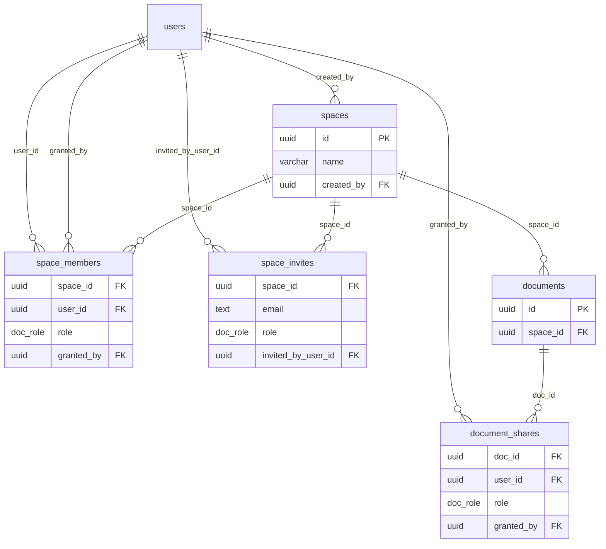

<!-- source: https://squiredocs.com/d/03bac6c7-78e3-449d-ab94-806580fa5a52
     synced-by: design/sync.mjs — DO NOT HAND-EDIT; amend the Squire doc and re-sync -->

# Squire Spaces (Shared Team Workspaces)

_Status: Ratified 2026-08-07 (Sam; D7 ratified as a starting point, open to revision once spaces are in use) · Scope: a named container for documents with a member list, so a team shares a set of documents by joining one space instead of sharing each document individually. Also adds granted_by attribution to document shares._

## Summary

A space is a named container for documents with a member list. Every document has exactly one home: the owner's personal area (no space, which is where all documents live today) or one space. Space membership gives each member a baseline role on every document in the space. Direct per-document shares keep working; a user's effective role on a document is the stronger of their direct share and their space role. Creating a space, inviting members by email, and moving documents in and out are the whole v1 surface.

The feature also adds a granted_by column to document_shares, closing the existing gap where the admin sharing view cannot say who granted a share.

## Concept

A user creates a space and becomes its owner. They invite teammates by email at a role (editor or viewer). Members see the space in their document list and every document in it. Any member who owns a document can move it into the space; from that moment every member can open it at their space role. A document can also be moved back out, which removes the space-derived access and leaves direct shares intact.

Spaces change who can reach a document. They do not change the document itself: realtime editing, presence, version history, and the agent surface all operate on documents exactly as before.

## Data Model

Three new tables and one new column, all additive. New migration timestamps must exceed 1795000000000 because of the phantom pgmigrations row left by the rolled-back feature 008.

```
spaces
  id uuid pk
  name varchar(100) not null
  created_by uuid null references users(id) on delete set null
  created_at, updated_at

space_members
  space_id uuid references spaces(id) on delete cascade
  user_id uuid references users(id) on delete cascade
  role doc_role not null
  granted_by uuid not null references users(id)
  created_at
  unique (space_id, user_id)

space_invites
  space_id uuid references spaces(id) on delete cascade
  email text not null
  role doc_role not null
  invited_by_user_id uuid null references users(id) on delete set null
  created_at
  unique (space_id, lower(email))

documents
  add space_id uuid null references spaces(id) on delete set null

document_shares
  add granted_by uuid not null references users(id)  (backfilled; see below)
```

Notes:

- space_members.role reuses the existing doc_role enum (owner, editor, viewer). The space creator gets an owner row.
- documents.space_id is nullable; null means personal, the state of every document today. The on delete set null clause encodes space deletion: deleting a space reverts its documents to personal and never deletes them.
- space_invites mirrors document_share_invites: pending grants for addresses with no account yet, converted at first login.



## Permission Model

A user's effective role on a document is:

```
effective_role(doc, user) = GREATEST(
  direct role from document_shares,
  space role from space_members via doc.space_id
)
```

Two rules produce that expression:

- Union (D3): direct shares and space membership both grant access, and the stronger one wins. Moving a document into a space never revokes an existing collaborator, and a space document can still be shared directly with someone outside the space (a contractor, for example).
- Passthrough (D5): the space role is not capped. A space-owner member holds the owner role on every document in the space, including deletion, direct-share management, and move-out. Granting the space owner role is therefore a grant of ownership over every current and future document in the space; the invite rule below means only an existing space owner can grant it. Unlike document sharing, where the owner role is never grantable, the space owner role is grantable by design: that is how a space gets more than one owner and how ownership transfer works.

Space-level operations:

| Operation | Requires |
| --- | --- |
| Create a space | any user; the creator gets the owner role |
| Invite a member at up to your own role | any member (matches document sharing, where a viewer can grant viewer) |
| Change a member's role, remove a member | space owner |
| Rename the space, delete the space | space owner |
| Leave the space | any member except the last owner |
| Move a document into the space | direct owner of the document who is also an editor or owner member of the space |
| Move a document out of the space | direct owner of the document, or a space owner |

Document-level requirements (REQUIRED_ROLES in server/permissions.js) are unchanged in v1: view needs viewer, edit needs editor, share needs viewer, manage needs editor, delete needs owner (D6). A viewer member can therefore share a space document onward at viewer, the same as any directly shared document today; the grant appears in the document's share list.

## Document Movement

Moving a document is a single update of documents.space_id. Access follows immediately: the list, search, and realtime surfaces derive access at query time, and live connections are re-checked against the database every 60 seconds, so a revoked space grant degrades or disconnects a connected editor within a minute using the machinery that already exists for direct shares.

Move rules (D7):

- Into a space: the mover must hold a direct owner share on the document and be an editor or owner member of the target space. Moving in grants access to every member, which is why it requires document ownership.
- Out of a space (to personal, or to another space the mover can add to): the document's direct owner, or a space owner. The space-owner path is curation: ejecting a document from the space without gaining content rights over it.
- A move never changes document_shares rows. Members who lose access lose only the space-derived part.

## Membership and Invites

Inviting is by email only in v1 (D4), the same flow as document sharing:

- An existing account is added to space_members immediately and notified by email.
- An unknown address gets a space_invites row and an invite email. At first login, a convertPendingSpaceInvites step turns pending rows into memberships, following the same pattern as document invite conversion in server/auth/users.js: transactional, ON CONFLICT DO NOTHING, and a pending invite never downgrades an existing membership.
- Re-inviting an existing member raises their role if the invited role is higher and otherwise does nothing.
- Outbound mail follows the existing gate: sends are suppressed unless the inviter's email_enabled flag is set, and membership is granted regardless. The mail goes through the existing server/email.js path with a space-invite template.

Leaving and removal:

- Any member can leave, except the last owner, who must first assign the owner role to another member or delete the space.
- Removal or leaving deletes the space_members row. Direct shares that member holds on space documents survive.

## granted_by on Document Shares

document_shares has no record of who granted a share, so the admin sharing view can only infer the grantor for owner-granted shares. This design closes that gap while the sharing surface is being touched anyway (D8):

- Add a granted_by column to document_shares referencing users(id), NOT NULL once the backfill has run.
- Backfill: existing rows get the document's current owner (the role='owner' share row for that document). A document whose owner account was deleted falls back to documents.creator_id, then to the share's own user_id, so the constraint holds everywhere. Backfilled values record the most likely grantor, not a verified one; only rows written after this change are exact.
- Every write path that inserts or upserts a share row records the acting user: the REST share endpoint, invite conversion in convertPendingInvites (from invited_by_user_id, which the invite row already carries), the MCP share_document tool, onboarding's welcome-doc owner row, and the owner row written at document creation (granted_by is the creator).
- The grantor foreign key is ON DELETE NO ACTION. Account deletion exists today as deleteUserByEmail in server/auth/users.js, reached by the synthetic-account wipe and the prod reset endpoint; before deleting the user row it must reassign rows the account granted to the document's current owner, the same rule as the backfill. (Amended 2026-08-07 during 053 planning: this bullet previously said no deletion path existed, which the analyze gate falsified; without the reassignment the new NOT NULL constraint makes those endpoints fail on any account that granted a share on a document it does not own.)
- space_members.granted_by is NOT NULL from the start, under the same reassignment rule. space_invites.invited_by_user_id stays nullable, matching document_share_invites.
- The admin per-user sharing view shows the grantor instead of the current unknowable caveat.

## Where Access Is Derived (Integration Points)

Access checks funnel through documents.getRole() for most surfaces, with a known set of bypasses. The implementation must cover all of them, or space documents will be readable in some surfaces and invisible in others.

1. documents.getRole() (server/documents.js) becomes the effective-role union query. This one change covers every /api/docs/:docId handler, the WebSocket upgrade check, and the 60-second live-connection recheck.
2. documents.getAccessibleDocuments() builds its own document_shares join for the document list. It gains the space leg, a space filter parameter, and space id and name on each row.
3. server/search.js has four independent document_shares joins: two keyword CTEs, the vector CTE, and the outer query. Each gains the space term. A missed leg makes space documents readable but absent from search results.
4. MCP tools with inline permission SQL (share-document, set-document-title, list-document-versions, set-document-version-name, agent-presence) are routed through the shared permission layer instead of teaching each inline query about spaces. share_document is already stricter than the REST endpoint (owner-only, no invite path, no email); converging it is part of this work.
5. server/api/admin.js and server/onboarding.js count owned documents directly from document_shares. Spaces do not affect them (ownership stays a direct share), but the granted_by work touches both.

Nothing changes in the Yjs realtime layer (rooms are per document; the role arrives through the upgrade check), presence and the awareness guard (identity is per principal), or version history.

## Agent Surface

sk_sqd_ tokens and OAuth delegations are user-scoped and re-derive document access per request, so an agent sees exactly its owner's spaces with no token-side changes. list_documents results gain the space name, and a space filter parameter is a natural addition. Space-scoped tokens would need new schema and are deferred.

## Product Surface

- Document list: a space section list. My Docs first, then one entry per space the user belongs to. The existing all / owned / shared-with-me filter applies within the selected scope.
- Document row and editor: a "Move to space" action, shown to direct owners; targets are spaces where the user is an editor or owner member. The editor header shows the containing space as a small chip.
- Space settings page: rename, member list with roles, invite box with a role picker (reusing the GET /api/users/search autocomplete), pending invites, leave and delete actions.
- Share dialog on a space document: unchanged for direct shares, plus a read-only line stating the space grant, for example "Everyone in Platform can edit (12 members)", so the effective audience is visible.
- New-document flow: creating a document while viewing a space sets space_id at creation. The creator still gets a direct owner share row, so their access never depends on their membership.
- Empty space: offers "Move documents here" and "New document".
- Creating a space: the document list’s scope selector ends with a "New space" action, and the move dialog offers the same action (create, then move the document into the new space in one step). Creation lands on the space settings page, where inviting members lives. (Added 2026-08-07: the surface list above implied spaces exist but named no way to create one; the built UI shipped without any creation affordance until Sam reported it.)

## REST API

```
POST   /api/spaces                       create with a name
GET    /api/spaces                       my spaces, with member count and my role
GET    /api/spaces/:id                   detail: members, pending invites, document count
PATCH  /api/spaces/:id                   rename (owner)
DELETE /api/spaces/:id                   delete; documents revert to personal (owner)
POST   /api/spaces/:id/members          invite by email at a role (member; role at most your own)
PUT    /api/spaces/:id/members/:userId  change a member's role (owner)
DELETE /api/spaces/:id/members/:userId  remove a member; removing yourself is leaving
DELETE /api/spaces/:id/invites          revoke a pending invite by email
PUT    /api/docs/:docId/space           move: body carries a space id or null
```

GET /api/docs gains a space parameter (a space id, personal, or all).

## Edge Cases

- The document creator leaves the space: the document stays in the space, and the creator keeps their direct owner share, so they can still open it, move it out, or delete it.
- A member is removed mid-edit: the 60-second recheck downgrades or disconnects their live connection. Direct shares they hold survive.
- Space deleted: documents revert to personal through the foreign key, and members lose only the space-derived access. The confirm dialog states the document count.
- Deleting a document in a space requires the owner role, which a space owner now holds through passthrough. Members below space owner cannot delete documents they do not directly own.
- Ownership transfer is a role change by an owner: set another member to owner, then optionally step down or leave.
- The last owner's account is deleted (deleteUserByEmail: synthetic wipe or prod reset): spaces where the account is the last owner are deleted before the user row, so documents revert to personal and direct shares survive. No member is promoted: under D5's uncapped passthrough, silent promotion would grant a member owner rights over every document in the space, a grant nobody made. (Added 2026-08-07 from post-merge review finding M2: the deletion path previously left such spaces permanently ownerless and unmanageable.)

## Decisions

| ID | Decision | Status |
| --- | --- | --- |
| D1 | One home per document: a nullable documents.space_id column; a document is personal or in exactly one space | Decided 2026-08-07 (Sam) |
| D2 | Space membership reuses the doc_role ladder (owner, editor, viewer) as the baseline role on space documents | Decided 2026-08-07 (Sam) |
| D3 | Union model: effective role is the stronger of the direct share and the space role; a move never revokes access | Decided 2026-08-07 (Sam) |
| D4 | Email invites only in v1; no join links | Decided 2026-08-07 (Sam) |
| D5 | The space role passes through uncapped: a space-owner member holds owner on every document in the space, including deletion, direct-share management, and move-out | Decided 2026-08-07 (Sam) |
| D6 | Document-level REQUIRED_ROLES unchanged in v1 (a viewer can share onward, an editor can manage shares) | Decided 2026-08-07 (Sam) |
| D7 | Move-in requires direct document ownership plus editor membership in the target; move-out requires document ownership or space ownership | Decided 2026-08-07 (Sam; a starting point, open to revision once spaces are in use) |
| D8 | granted_by is added to document_shares as NOT NULL: existing rows are backfilled with the document's owner, and every new grant records the acting user | Decided 2026-08-07 (Sam; amended same day: backfill with the document owner, then disallow null) |

## Non-Goals (Deferred)

- Join links. A join URL would be the product's first bearer-token access grant and needs its own security review.
- Folders or any hierarchy inside a space.
- Space-scoped API tokens.
- Per-space notification settings.
- Auto-join by email domain, and org constructs above spaces.
- A space-centric admin view. v1 only adds space names to the existing per-user sharing detail on the admin page.