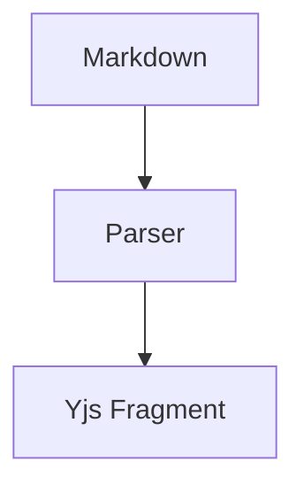

# ADR 007: Adopt Server-Side Markdown Import

## Status

Accepted

## Context

Documents are authored in many tools — **spec-kit**, static-site generators,
and _agent pipelines_ — and land in our repos as markdown. Today there is no
way to get that content into Squire without hand-building blocks through many
`modify` calls.

We evaluated three approaches:

1. Client-side paste conversion
2. Server-side import module
   1. Exposed over REST
   2. Exposed over MCP
3. A standalone CLI converter

- Pros of server-side import:
  - One code path for every surface
  - Attribution and undo boundaries preserved
- Cons:
  - New ingestion surface to secure

## Decision

We will build a single server-side import module. See the
[design doc](https://example.com/design/markdown-import) and the internal
notes at [sync plan](/d/some-doc-guid).

| Surface | Transport | Mode support |
| ------- | --------- | ------------ |
| REST PUT | HTTP | append, replace |
| REST POST | HTTP | create |
| MCP tool | JSON-RPC | create |

```js
// Example client call
await fetch('/api/docs/import', { method: 'POST', body: markdown });
```



> The import module never interprets markdown itself; the parser owns the
> grammar.

## Consequences

Imports become a *first-class* write path with `documents:write` scope
enforcement, and export finally has an inverse.

---

Last reviewed 2026-07-13.
