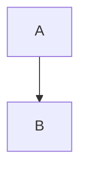

# Baseline Title

Plain paragraph text.

### Subsection

`code text`

**bold text**

_italic text_

~~strike text~~

<u>underline text</u>

<mark>highlight text</mark>

<sub>subscript text</sub>

<sup>superscript text</sup>

<span style="color:#ff0000">color styled</span>

<span style="background-color:#00ff00">backgroundColor styled</span>

<span style="font-size:18px">fontSize styled</span>

<span style="font-family:Georgia">fontFamily styled</span>

<span style="line-height:1.8">lineHeight styled</span>

<span style="color:#333333;font-size:20px">multi styled</span>

[a link](https://example.com/page)

_**bold italic**_

- parent item
  - child item
- second item

1. first step
2. second step

> quoted wisdom

---

| Col A | Col B |
| --- | --- |
| a1 | b1 |

```js
const x = 1;
console.log(x);
```



```svg
<svg xmlns="http://www.w3.org/2000/svg"><rect width="5" height="5"/></svg>
```

