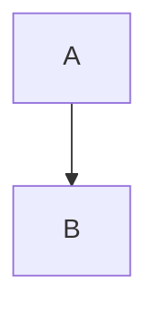

# Quickstart Validation: Markdown Import Surfaces

Runnable scenarios proving the feature end-to-end. Details live in [contracts/](./contracts/) and [data-model.md](./data-model.md); this is the validation script, not the implementation guide.

## Prerequisites

- Feature 001 merged (`markdownToPm` tolerant mode under `shared/`). Blocked otherwise.
- Dev environment per `docs/dev.md` (run inside the Minikube `app-dev` pod; restart the dev server if mutagen left it stale).
- An `sk_sqd_` token with default scopes in `$SQUIRE_TOKEN`; base URL in `$BASE` (e.g. `http://localhost:3001`).
- Sandbox bundle rebuilt after sandbox edits: `npm run build:sandbox-bundle`.
- S3 image storage configured for the image scenarios (unset ⇒ expect `storage-disabled` degradations instead of rehosts).

## Automated suites (the authoritative gate — Principle II)

```bash
# Backend, serial, from repo root (never run backend suites concurrently)
npx jest server/__tests__/markdown-import.test.js \
         server/__tests__/image-rehost.test.js \
         server/mcp/sandbox/__tests__/from-markdown.test.js \
         __tests__/integration/docs-import-api.test.js \
         server/__tests__/import-roundtrip.test.js --runInBand
```

Expected: all pass; the SSRF suite reports zero connections to blocked ranges; round-trip property passes for every existing test document.

## Scenario 1 — One-call create (US1)

```bash
cat > /tmp/adr.md <<'EOF'
---
squire:
  title: Payments Redesign
other-tool: keep-me
---
# Payments Redesign

Intro **bold** and a list:

- [ ] task one
- item two


EOF

curl -sf -X POST -H "Authorization: Bearer $SQUIRE_TOKEN" \
  -H "Content-Type: text/markdown" --data-binary @/tmp/adr.md \
  "$BASE/api/docs/import" | tee /tmp/create.json
```

Expect: 201; `title` = "Payments Redesign" (from frontmatter); body starts with a `yaml` code block containing only `other-tool: keep-me` (no `squire:` residue); `# Payments Redesign` heading still in body; mermaid block present; open `/d/<docId>` and confirm rich blocks + one attributed version entry. Same via MCP: `create_document({ markdown: "..." })` with no title.

## Scenario 2 — PUT append/replace + access control (US2)

```bash
DOC=$(jq -r .docId /tmp/create.json)
# append (default mode)
curl -sf -X PUT -H "Authorization: Bearer $SQUIRE_TOKEN" -H "Content-Type: text/markdown" \
  --data-binary $'## Progress\nDone step 1.' "$BASE/api/docs/$DOC/import"
# replace
curl -sf -X PUT -H "Authorization: Bearer $SQUIRE_TOKEN" -H "Content-Type: text/markdown" \
  --data-binary $'# Fresh\nRegenerated.' "$BASE/api/docs/$DOC/import?mode=replace"
# negative matrix
curl -s -o /dev/null -w '%{http_code}\n' -X PUT -H "Authorization: Bearer $READONLY_TOKEN" \
  -H "Content-Type: text/markdown" --data-binary 'x' "$BASE/api/docs/$DOC/import"        # 403 INSUFFICIENT_SCOPE
curl -s -o /dev/null -w '%{http_code}\n' -X PUT -H "Authorization: Bearer $VIEWER_TOKEN" \
  -H "Content-Type: text/markdown" --data-binary 'x' "$BASE/api/docs/$DOC/import"        # 403 (viewer)
curl -s -o /dev/null -w '%{http_code}\n' -X PUT -H "Authorization: Bearer $SQUIRE_TOKEN" \
  -H "Content-Type: application/json" -d '{}' "$BASE/api/docs/$DOC/import"               # 415
curl -s -o /dev/null -w '%{http_code}\n' -X PUT -H "Authorization: Bearer $SQUIRE_TOKEN" \
  -H "Content-Type: text/markdown" --data-binary '' "$BASE/api/docs/$DOC/import"          # 400 (empty)
curl -s -o /dev/null -w '%{http_code}\n' -X PUT -H "Authorization: Bearer $SQUIRE_TOKEN" \
  -H "Content-Type: text/markdown" --data-binary 'x' "$BASE/api/docs/$DOC/import?mode=nuke" # 400 (mode)
```

Expect: append leaves prior content + attribution untouched and returns the new `clock`; replace leaves exactly the new blocks, is one undo step (Cmd+Z in the editor restores the old body in one step), attributed to the token identity in version history.

## Scenario 3 — `fromMarkdown` in modify (US3)

```
modify({ docGuid, script: `
  export default function edit(doc) {
    const nodes = fromMarkdown("## Notes\\n- item **bold**");
    const h = xpathFirst('//heading[@level=1]');
    const idx = doc.toArray().indexOf(h) + 1; // insert right after the located heading
    doc.insert(idx, nodes);
  }` })
```

Expect: heading + bullet list with bold run appear, streamed live; `fromMarkdown("")` returns `[]`; garbage input yields literal-text paragraphs, never a throw. `get_tool_documentation({ tool: "modify" })` shows a `fromMarkdown` example and **no** regex markdown-conversion example (SC-008).

## Scenario 4 — Image policy (US4)

Import markdown referencing: a reachable public PNG, an unreachable URL, `http://169.254.169.254/x.png`, and `data:image/png;base64,AAAA`, plus one URL referenced five times.

Expect in the response `images` report: 1 `rehosted` (src now an app URL; row in `document_images` attributed to you; five references share one copy), 2 `degraded` (plain links with reasons), 1 `rejected` (`data-url`); document inspection (export it back) shows zero external/`data:` srcs (SC-003). SSRF suite asserts zero connections to blocked ranges (SC-004).

## Scenario 5 — Round-trip + performance (SC-005/007)

```bash
# Round-trip: export any real doc, import into a fresh doc, re-export, compare text/structure
curl -sf -H "Authorization: Bearer $SQUIRE_TOKEN" "$BASE/api/docs/$DOC/export" -o /tmp/rt.md
NEW=$(curl -sf -X POST -H "Authorization: Bearer $SQUIRE_TOKEN" -H "Content-Type: text/markdown" \
  --data-binary @/tmp/rt.md "$BASE/api/docs/import" | jq -r .docId)
curl -sf -H "Authorization: Bearer $SQUIRE_TOKEN" "$BASE/api/docs/$NEW/export" | diff - /tmp/rt.md
# Perf: 1 MB no-image import
time curl -sf -X PUT -H "Authorization: Bearer $SQUIRE_TOKEN" -H "Content-Type: text/markdown" \
  --data-binary @/tmp/big-1mb.md "$BASE/api/docs/$DOC/import"   # < 5 s
```

Expect: diff empty modulo the frontmatter/title heading rules (the property test in CI is the precise oracle); 1 MB import < 5 s.

## Scenario 6 — Concurrent-edit safety (SC-006)

With the doc open in a browser and someone typing, run an `append` PUT. Expect both streams intact (no lost keystrokes); the collaboration integration test automates this.
